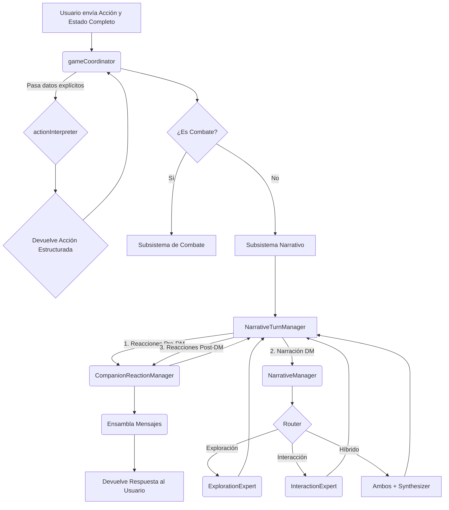

# Arquitectura del Backend (Sistema de IA)

**Última actualización:** 2025-01-23 (v0.5.6 - Sistema Data-Driven)  
**Estado:** ✅ Actualizado

---

En este proyecto, la totalidad de la lógica del lado del servidor (el **backend**) está contenida en el sistema de Inteligencia Artificial construido con Genkit. Por lo tanto, este documento describe la arquitectura de dicho sistema, que es la base de todo el funcionamiento del juego. 

El sistema está diseñado para ser modular, predecible y extensible.

---

## Principios de Diseño

La arquitectura se basa en cuatro principios fundamentales:

1.  **Especialización:** Cada flujo de IA es un "experto" con una única responsabilidad (interpretar, narrar, decidir tácticas). Esto evita la creación de una IA monolítica y difícil de depurar.

2.  **Orquestación Lógica:** Un director de orquesta (`gameCoordinator`) toma las decisiones lógicas. No genera texto creativo, sino que dirige el flujo de datos y decide qué experto llamar en cada momento, garantizando un proceso predecible.

3.  **Flujo de Datos Explícito (Arquitectura "Stateless"):** Este es el principio más importante. **No existe un estado global en el backend.** Todos los datos que una herramienta o flujo necesita (como el contexto de la ubicación o los datos de los personajes) se le pasan explícitamente como parámetros en cada llamada. Esto elimina las dependencias ocultas y hace que el sistema sea robusto, predecible y fácil de depurar.

4.  **Abstracción con Herramientas:** Las IAs no interactúan directamente con el mundo del juego. Usan "herramientas" (funciones de TypeScript) para obtener información (ej: `locationLookupTool`) o realizar acciones (ej: `diceRollerTool`).

---

## Regla Arquitectónica Crucial: Gestión de Esquemas (Schemas)

Para mantener la modularidad y evitar dependencias circulares, se establecen las siguientes reglas:

-   **Fuente Única de la Verdad para Esquemas:** Todos los esquemas de Zod que definen las estructuras de datos compartidas entre flujos y herramientas **DEBEN** residir en `src/ai/flows/schemas.ts`.
-   **Prohibición de Exportar Esquemas desde Archivos de Implementación:** Un archivo que contiene la lógica de un flujo (como `action-interpreter.ts`) **NO DEBE** exportar esquemas. Debe importar los esquemas que necesite desde el archivo central `schemas.ts`.
-   **Directiva de Verificación (Para el Asistente de IA):** Cada vez que un esquema cambie, se deben verificar todas sus implementaciones y puntos de llamada (`game-coordinator.ts`, `combat-manager.ts`, `game-view.tsx`, etc.) para asegurar que el "contrato" de datos no se ha roto.

**Razón:** Esta separación y verificación previene errores de importación y fallos de validación silenciosos, asegurando que la definición de los "contratos" de datos está desacoplada de su implementación, pero sincronizada con su uso.

---

## Diagrama de Flujo de un Turno Típico (Alto Nivel)



> 📊 **Para diagramas detallados del flujo de datos**, consulta [Flujo de Datos](./flujo-datos.md) que incluye:
> - Flujo general de una acción (con diagramas de secuencia)
> - Flujo de exploración detallado
> - Flujo de combate completo
> - Flujo de guardado y carga
> - Flujo de tiradas de dados

---

## Desglose de Componentes

### 1. El Orquestador Lógico

#### `gameCoordinator`
-   **Archivo**: `src/ai/flows/game-coordinator.ts`
-   **Rol**: El cerebro lógico y director de orquesta del juego.
-   **Responsabilidades**:
    1.  Recibir el estado completo del juego desde el cliente.
    2.  Invocar a los expertos y herramientas en un orden lógico y predecible.
    3.  Gestionar el flujo de datos explícito, pasando la información necesaria a cada componente.
    4.  Ensamblar todas las respuestas generadas en el turno en un único array de mensajes.
    5.  Devolver el estado final y los mensajes al cliente, respetando el orden de generación.

### 2. Managers Especializados

#### `NarrativeTurnManager`
-   **Archivo**: `src/ai/flows/managers/narrative-turn-manager.ts`
-   **Rol**: Orquestador del flujo narrativo completo (fuera de combate).
-   **Responsabilidades**:
    1. Gestiona movimiento y cambio de ubicación
    2. Genera reacciones de compañeros **antes** de la narración del DM (reacciones a la intención)
    3. Filtra contexto (enemigos muertos) antes de pasar a la narración
    4. Genera narración del DM usando `NarrativeManager`
    5. Genera reacciones de compañeros **después** de la narración del DM (reacciones al resultado)
-   **Flujo**: `executeNarrativeTurn()` encapsula todo el proceso de un turno narrativo
-   **Uso**: Invocado por `gameCoordinator` cuando la acción no es de combate

### 3. Expertos de IA Primarios

#### `actionInterpreter`
-   **Archivo**: `src/ai/flows/action-interpreter.ts`
-   **Rol**: Traduce el lenguaje natural del jugador a un objeto de acción estructurado.

#### `NarrativeManager` (Reemplaza al antiguo `narrativeExpert`)
-   **Archivo**: `src/ai/flows/narrative-manager.ts`
-   **Rol**: Orquestador del "Modo Blando" que analiza la intención del jugador y enruta a expertos especializados.
-   **Responsabilidades**:
    1. Analizar la intención del jugador (Exploración vs Interacción vs Híbrido)
    2. Enrutar a los expertos apropiados (`ExplorationExpert`, `InteractionExpert`)
    3. Sintetizar respuestas para acciones híbridas
    4. Manejar iniciación de combate (modo legacy/especial)
-   **Arquitectura**:
    - **Router**: Clasifica la acción en EXPLORATION, INTERACTION, o HYBRID
    - **ExplorationExpert**: Genera descripciones ambientales y gestiona movimiento
    - **InteractionExpert**: Gestiona diálogos con NPCs y tiradas sociales
    - **Synthesizer**: Combina ambas narrativas para acciones híbridas
-   **Compatibilidad**: Exporta `narrativeExpert` como wrapper para mantener compatibilidad con código existente.

### 4. El Subsistema de Combate

El subsistema de combate ha sido simplificado significativamente (Issue #117) para unificar el procesamiento de turnos de jugador e IA, eliminando duplicación y mejorando la consistencia.

#### `combatInitiationExpertTool`
-   **Archivo**: `src/ai/tools/combat-initiation-expert.ts`
-   **Rol**: Determina si una acción debe iniciar un combate.
-   **Entrada**: Acción del jugador, ubicación actual, contexto de la ubicación, party
-   **Salida**: Decisión sobre si iniciar combate y qué enemigos incluir

#### `combatManagerTool`
-   **Archivo**: `src/ai/tools/combat-manager.ts`
-   **Rol**: Gestiona el orden de iniciativa y orquesta los turnos.
-   **Responsabilidades**:
    - Calcula el orden de iniciativa al iniciar el combate
    - Gestiona el bucle de turnos de combate
    - Procesa turnos de IA (compañeros y enemigos) automáticamente
    - Cede el control al jugador cuando es su turno
    - Gestiona el estado del combate (turnIndex, initiativeOrder)
-   **Arquitectura**: Utiliza `CombatSession` que delega a `TurnProcessor` para procesar todos los turnos de forma unificada.

#### `CombatSession`
-   **Archivo**: `src/lib/combat/combat-session.ts`
-   **Rol**: Encapsula el estado del combate y proporciona métodos para manipularlo.
-   **Responsabilidades**:
    - Mantiene el estado del combate (party, enemies, initiativeOrder, turnIndex)
    - Proporciona métodos para inicializar y procesar turnos
    - Delega el procesamiento de turnos a `TurnProcessor` (unificado para jugador e IA)

#### `TurnProcessor` (Nuevo - Unificado)
-   **Archivo**: `src/lib/combat/turn-processor.ts`
-   **Rol**: Procesa un turno completo (planificación → intención → ejecución → resolución) de forma unificada para jugador e IA.
-   **Flujo**:
    1. **Planificación**: Si es IA, consulta al tactician correspondiente. Si es jugador, usa la acción interpretada.
    2. **Extracción de Arma** (v0.5.6): Para jugadores, usa `extractWeaponName()` para parsear el nombre del arma de la acción del jugador.
    3. **Resolución de Acción**: Llama a `CombatActionResolver.resolveAttack()` para calcular tiradas usando estadísticas reales.
    4. **Narración de Intención**: Genera narración descriptiva de la acción planificada.
    5. **Ejecución**: Llama a `CombatActionExecutor` para ejecutar la acción (tiradas, daño, efectos).
    6. **Narración de Resolución**: Genera narración descriptiva del resultado.
-   **Función `extractWeaponName()`** (v0.5.6):
    - Extrae nombres de armas desde acciones de jugador usando patrones regex
    - Soporta caracteres acentuados en español (á, é, í, ó, ú, ñ, ü)
    - Patrones: "con [arma]", "usando [arma]", "mi [arma]", "el/la [arma]"
    - Fallback seguro a `'ataque'` cuando no se menciona arma específica
-   **Beneficios**: Elimina duplicación entre flujos de jugador e IA, garantiza consistencia.

#### `CombatActionResolver` (Nuevo - v0.5.6)
-   **Archivo**: `src/lib/combat/action-resolver.ts`
-   **Rol**: Centraliza la lógica para resolver acciones de combate (ataques, hechizos) en tiradas de dados. Es la "fuente única de verdad" para cálculos de combate.
-   **Responsabilidades**:
    - Calcula tiradas de ataque y daño basándose en estadísticas reales del combatiente
    - Determina qué atributo usar (FUE/DES) según tipo de arma (melee/ranged/finesse) usando sistema data-driven
    - Establece `attributeUsed` y `attackRange` en las tiradas para el frontend
    - Proporciona fallback robusto si no encuentra arma específica
-   **Sistema Data-Driven para Propiedades de Armas** (v0.5.6):
    - **Prioridad 1 - Datos Estructurados:** Lee `attacks[].properties` explícitas (ej: `['Finesse', 'Light']`) de jugadores/compañeros
    - **Prioridad 2 - Análisis de Texto:** Parsea descripciones buscando palabras clave ("Sutil", "Finesse", "Alcance", "Ranged Weapon Attack")
    - **Prioridad 3 - Heurística de Nombres (Fallback):** Solo si lo anterior falla, usa lista de nombres como red de seguridad
    - **Funciones helper comunes:**
      - `getWeaponProperties()`: Extrae propiedades de armas usando las 3 fuentes de datos
      - `determineWeaponAttribute()`: Determina qué atributo usar (FUE/DES) basándose en propiedades detectadas
      - Ambas funciones son comunes para jugadores, compañeros y enemigos
-   **Arquitectura "Cerebro Centralizado, Frontend Obediente"**:
    - El backend (`CombatActionResolver`) es la única fuente de verdad para cálculos
    - El frontend recibe `attributeUsed` y `attackRange` explícitamente, sin adivinar
    - Elimina inconsistencias entre cálculos de jugador e IA
-   **Métodos principales**:
    - `resolveAttack()`: Resuelve un ataque físico en `DiceRollRequest[]` (detecta automáticamente si es jugador o enemigo)
    - `resolvePlayerAttack()`: Lógica específica para jugadores y compañeros (usa inventario y `attacks` array)
    - `resolveEnemyAttack()`: Lógica específica para enemigos (usa `actions` de la API de D&D)
    - `getWeaponProperties()`: Helper común para extraer propiedades de armas (privado)
    - `determineWeaponAttribute()`: Helper común para determinar atributo usado (privado)
-   **Diferencias entre `resolvePlayerAttack` y `resolveEnemyAttack`**:
    - **Jugadores/Compañeros (`resolvePlayerAttack`):**
      - Busca arma en `inventory` del personaje
      - Calcula bonos desde cero usando `abilityModifiers` + `proficiencyBonus`
      - Usa `player.attacks` array (datos estructurados) y `weapon.description` (inventario)
      - Extrae `damageDie` de la descripción del inventario
    - **Enemigos (`resolveEnemyAttack`):**
      - Busca acción en `enemy.actions` (datos de la API de D&D)
      - Usa `attack_bonus` pre-calculado de la API (ya viene calculado)
      - Usa `action.desc` (descripción de la API) para parsear propiedades
      - Usa `damage_dice` pre-calculado de la API
    - **Ambos usan las mismas funciones helper** para detectar propiedades (finesse, ranged)
-   **Beneficios**: 
    - ✅ Consistencia total: Jugadores, compañeros y enemigos siguen las mismas reglas matemáticas
    - ✅ Visualización perfecta: El desglose visual siempre coincide con el cálculo matemático
    - ✅ Robustez: Si la IA alucina, el sistema corrige usando las reglas reales
    - ✅ Eliminación de la "doble verdad": Una sola fuente de verdad (las estadísticas del sistema)
    - ✅ Data-driven: Prioriza datos estructurados sobre heurísticas hardcodeadas

#### `CombatActionExecutor` (Nuevo - Unificado)
-   **Archivo**: `src/lib/combat/action-executor.ts`
-   **Rol**: Ejecuta cualquier acción de combate (ataque, hechizo, curación) independientemente de quién la ejecute.
-   **Responsabilidades**:
    - Recibe `DiceRollRequest[]` de `CombatActionResolver` o de la IA
    - Procesa tiradas de ataque y compara con AC
    - Procesa tiradas de daño/curación
    - Preserva `attributeUsed` y `attackRange` en los `DiceRoll` finales
    - Aplica resultados usando `RulesEngine`
    - Retorna resultados estructurados (NO genera mensajes - eso es responsabilidad de `TurnProcessor`)
-   **Beneficios**: Unifica la lógica que antes estaba duplicada en `action-processor.ts` y `dice-roll-processor.ts`.

#### `CombatInitializer` (Simplificado)
-   **Archivo**: `src/lib/combat/combat-initializer.ts`
-   **Rol**: Inicializa el estado del combate (enemigos, iniciativa, orden).
-   **Responsabilidades**:
    - Valida combatants
    - Obtiene stats de enemigos
    - Genera tiradas de iniciativa
    - Crea `initiativeOrder`
    - **NO procesa turnos** - eso lo hace `TurnProcessor` de forma unificada

#### `companionTacticianTool`
-   **Archivo**: `src/ai/tools/companion-tactician.ts`
-   **Rol**: Decide las acciones tácticas de los compañeros controlados por IA durante el combate.
-   **Lógica**: 
    - Prioriza curar aliados heridos si tiene habilidades de curación
    - Si no puede curar o no hay aliados heridos, ataca a enemigos
    - Considera el contexto del combate y el estado de aliados/enemigos
-   **Salida**: `actionDescription` (etiqueta técnica), `targetId`, tiradas de dados necesarias. **NO genera narración.**

#### `enemyTacticianTool`
-   **Archivo**: `src/ai/tools/enemy-tactician.ts`
-   **Rol**: Decide las acciones tácticas de los enemigos durante el combate.
-   **Lógica**:
    - Ataca a los miembros más débiles de la party
    - Considera el contexto del combate y el estado de aliados
    - Puede usar habilidades especiales según el tipo de enemigo
-   **Salida**: `actionDescription` (etiqueta técnica), `targetId`, tiradas de dados necesarias. **NO genera narración.**

#### `combatNarrationExpertTool`
-   **Archivo**: `src/ai/tools/combat/combat-narration-expert.ts`
-   **Rol**: Genera una narrativa descriptiva y completa para acciones de combate.
-   **Funcionalidad**:
    - Genera una **única narración completa** que incluye:
      1. **Preparación/Intención**: Cómo el atacante se prepara o inicia la acción
      2. **Ejecución**: El movimiento del ataque, sonidos, detalles visuales
      3. **Impacto**: Cómo conecta (o falla) y la reacción del objetivo
      4. **Resultado**: Resultado final (efecto de daño, muerte, fallo)
    - **NO genera narraciones separadas** de intención y resolución (esto cambió tras Issue #94)
-   **Salida**: Texto narrativo completo en español de España, integrando todos los elementos en una narrativa fluida.

### 5. Herramientas de Apoyo

#### `CompanionReactionManager`
-   **Archivo**: `src/ai/flows/managers/companion-reaction-manager.ts`
-   **Rol**: Gestiona las reacciones de compañeros en flujos narrativos (fuera de combate).
-   **Funcionalidad**:
    - Se invoca **dos veces** durante un turno narrativo:
      1. **Antes de la narración del DM** (`timing: 'before_dm'`): Reacciones a la intención del jugador
      2. **Después de la narración del DM** (`timing: 'after_dm'`): Reacciones al resultado de lo sucedido
    - Utiliza `companionExpertTool` internamente para generar los diálogos
-   **Uso**: Invocado por `NarrativeTurnManager` para gestionar el flujo completo de reacciones de compañeros.

#### `companionExpertTool` (Herramienta interna)
-   **Archivo**: `src/ai/tools/companion-expert.ts`
-   **Rol**: Genera los diálogos de los compañeros de IA (usado internamente por `CompanionReactionManager`).
-   **Patrón**: Sigue un patrón robusto de dos pasos: primero consulta los datos del personaje con `characterLookupTool` y luego inyecta esa información en un prompt para generar la reacción.

#### `characterLookupTool`
-   **Archivo**: `src/ai/tools/character-lookup.ts`
-   **Rol**: Una simple función de consulta. Recibe un array de la `party` y el nombre de un personaje, y devuelve los datos completos de ese personaje.
-   **Nota**: **No es una herramienta de IA por sí misma**, sino una utilidad de TypeScript que otras herramientas pueden usar.

#### `locationLookupTool`
-   **Archivo**: `src/ai/tools/location-lookup.ts`
-   **Rol**: Consulta información sobre una ubicación específica del mundo del juego.
-   **Uso**: Permite a los flujos de IA obtener detalles sobre la ubicación actual, puntos de interés, y posibles amenazas.

#### `adventureLookupTool`
-   **Archivo**: `src/ai/tools/adventure-lookup.ts`
-   **Rol**: Consulta información general sobre la aventura (lore, personajes, misiones).
-   **Uso**: Permite a los flujos de IA acceder al conocimiento del mundo del juego almacenado en los archivos JSON de aventuras.

#### `diceRollerTool`
-   **Archivo**: `src/ai/tools/dice-roller.ts`
-   **Rol**: Realiza tiradas de dados según la notación de D&D (ej: "1d20+5", "2d6+3").
-   **Funcionalidad**: 
    - Parsea la notación de dados
    - Calcula el resultado
    - Devuelve información detallada sobre la tirada
-   **Uso**: Utilizado por el sistema de combate y otras herramientas que necesitan realizar tiradas.

#### `dndApiLookupTool`
-   **Archivo**: `src/ai/tools/dnd-api-lookup.ts`
-   **Rol**: Consulta información sobre reglas, monstruos, conjuros y objetos de D&D 5e desde una API externa.
-   **API**: Utiliza `https://www.dnd5eapi.co/api`
-   **Uso**: Permite a la IA obtener información precisa sobre reglas de D&D cuando es necesario.

### 6. Flujos de Utilidad

#### `oocAssistant`
-   **Archivo**: `src/ai/flows/ooc-assistant.ts`
-   **Rol**: Asistente fuera de personaje (Out of Character). Responde preguntas del jugador sobre reglas, mecánicas o el estado del juego.
-   **Activación**: Se activa cuando el jugador envía un mensaje que comienza con "//" o "OOC:"
-   **Uso**: Permite al jugador hacer preguntas sin romper la inmersión del juego.

#### `generateDmNarrationAudio`
-   **Archivo**: `src/ai/flows/generate-dm-narration-audio.ts`
-   **Rol**: Convierte la narración del DM a audio usando Text-to-Speech.
-   **Tecnología**: Utiliza Google Gemini 2.5 Flash Preview TTS
-   **Salida**: Audio en formato WAV como data URI
-   **Uso**: Opcional, puede ser usado para añadir narración por voz al juego.

#### `markdownToHtml`
-   **Archivo**: `src/ai/flows/markdown-to-html.ts`
-   **Rol**: Convierte texto en formato Markdown a HTML para renderizado en el frontend.
-   **Uso**: Procesa la narración del DM que puede contener formato Markdown.

#### `parseAdventureFromJson`
-   **Archivo**: `src/ai/flows/parse-adventure-from-json.ts`
-   **Rol**: Parsea y carga aventuras desde archivos JSON.
-   **Uso**: Carga la estructura de la aventura al iniciar el juego.

#### `generateMonsterEncounters`
-   **Archivo**: `src/ai/flows/generate-monster-encounters.ts`
-   **Rol**: Genera encuentros con monstruos basados en el nivel del grupo y el entorno.
-   **Uso**: Puede ser usado para generar encuentros dinámicos (actualmente no está activo en el flujo principal).

---

## Apéndice: Flujo de Datos (Ejemplo de Reacción de Compañero)

Este ejemplo ilustra el principio de **flujo de datos explícito**:

**1. Origen (Cliente - `game-view.tsx`)**
-   El jugador escribe: `"Vamos a la posada."`
-   `handleSendMessage` envía el estado completo al `gameCoordinator`, incluyendo el array `party`.

**2. `gameCoordinator` orquesta la reacción**
-   El `gameCoordinator` decide que es el turno de Elara para reaccionar.
-   **Acción**: Invoca al `companionExpertTool`.
-   **Entrada para la herramienta**:
    ```typescript
    await companionExpertTool({
        party: party, // <--- El array completo de la party
        characterName: "Elara",
        context: "The player's action is: \"Vamos a la posada\"",
        inCombat: false,
    });
    ```

**3. `companionExpertTool` obtiene los detalles**
-   La herramienta recibe la `party` y el nombre "Elara".
-   **Acción**: Llama a la función `characterLookupTool` internamente.
-   **Entrada para la sub-herramienta**:
    ```typescript
    await characterLookupTool({
        party: party, // <--- Pasa la party que recibió
        characterName: "Elara",
    });
    ```
-   **Salida**: `characterLookupTool` devuelve el objeto completo de Elara.

**4. `companionExpertTool` genera la reacción**
-   La herramienta ahora tiene todos los datos de Elara.
-   **Acción**: Llama a su prompt de IA, inyectando la personalidad y el contexto de Elara.
-   **Salida**: La IA genera el diálogo: `"Me parece una buena idea."`

**5. El ciclo se completa**
-   La reacción se devuelve al `gameCoordinator`, que la añade al array de mensajes del turno.
-   El proceso es predecible, depurable y no depende de ningún estado oculto.
