# Arquitectura del Backend (Sistema de IA)

En este proyecto, la totalidad de la lógica del lado del servidor (el **backend**) está contenida en el sistema de Inteligencia Artificial construido con Genkit. Por lo tanto, este documento describe la arquitectura de dicho sistema, que es la base de todo el funcionamiento del juego. 

El sistema está diseñado para ser modular, predecible y extensible.

---

## Principios de Diseño

La arquitectura se basa en cuatro principios fundamentales:

1.  **Especialización:** Cada flujo de IA es un "experto" con una única responsabilidad (interpretar, narrar, decidir tácticas). Esto evita la creación de una IA monolítica y difícil de depurar.

2.  **Orquestación Lógica:** Un director de orquesta (`gameCoordinator`) toma las decisiones lógicas. No genera texto creativo, sino que dirige el flujo de datos y decide qué experto llamar en cada momento, garantizando un proceso predecible.

3.  **Flujo de Datos Explícito (Arquitectura "Stateless"):** Este es el principio más importante. **No existe un estado global en el backend.** Todos los datos que una herramienta o flujo necesita (como el contexto de la ubicación o los datos de los personajes) se le pasan explícitamente como parámetros en cada llamada. Esto elimina las dependencias ocultas y hace que el sistema sea robusto, predecible y fácil de depurar.

4.  **Abstracción con Herramientas:** Las IAs no interactúan directamente con el mundo del juego. Usan "herramientas" (funciones de TypeScript) para obtener información (ej: `locationLookupTool`) o realizar acciones (ej: `diceRollerTool`).

---

## Regla Arquitectónica Crucial: Gestión de Esquemas (Schemas)

Para mantener la modularidad y evitar dependencias circulares, se establecen las siguientes reglas:

-   **Fuente Única de la Verdad para Esquemas:** Todos los esquemas de Zod que definen las estructuras de datos compartidas entre flujos y herramientas **DEBEN** residir en `src/ai/flows/schemas.ts`.
-   **Prohibición de Exportar Esquemas desde Archivos de Implementación:** Un archivo que contiene la lógica de un flujo (como `action-interpreter.ts`) **NO DEBE** exportar esquemas. Debe importar los esquemas que necesite desde el archivo central `schemas.ts`.
-   **Directiva de Verificación (Para el Asistente de IA):** Cada vez que un esquema cambie, se deben verificar todas sus implementaciones y puntos de llamada (`game-coordinator.ts`, `combat-manager.ts`, `game-view.tsx`, etc.) para asegurar que el "contrato" de datos no se ha roto.

**Razón:** Esta separación y verificación previene errores de importación y fallos de validación silenciosos, asegurando que la definición de los "contratos" de datos está desacoplada de su implementación, pero sincronizada con su uso.

---

## Diagrama de Flujo de un Turno Típico (Alto Nivel)

```mermaid
graph TD
    A[Usuario envía Acción y Estado Completo] --> B(gameCoordinator);
    B -- Pasa datos explícitos --> C{actionInterpreter};
    C --> D{Devuelve Acción Estructurada};
    D --> B;
    B --> E{¿Es Combate?};
    E -- Sí --> F[Subsistema de Combate];
    E -- No --> G[Subsistema Narrativo];
    G -- 1. Reacciones de Compañeros --> H(companionExpertTool);
    H -- 2. Narración del DM --> I(narrativeExpert);
    I --> J(Ensambla Mensajes);
    J --> K[Devuelve Respuesta al Usuario];
```



> 📊 **Para diagramas detallados del flujo de datos**, consulta [Flujo de Datos](./flujo-datos.md) que incluye:
> - Flujo general de una acción (con diagramas de secuencia)
> - Flujo de exploración detallado
> - Flujo de combate completo
> - Flujo de guardado y carga
> - Flujo de tiradas de dados

---

## Desglose de Componentes

### 1. El Orquestador Lógico

#### `gameCoordinator`
-   **Archivo**: `src/ai/flows/game-coordinator.ts`
-   **Rol**: El cerebro lógico y director de orquesta del juego.
-   **Responsabilidades**:
    1.  Recibir el estado completo del juego desde el cliente.
    2.  Invocar a los expertos y herramientas en un orden lógico y predecible.
    3.  Gestionar el flujo de datos explícito, pasando la información necesaria a cada componente.
    4.  Ensamblar todas las respuestas generadas en el turno en un único array de mensajes.
    5.  Devolver el estado final y los mensajes al cliente, respetando el orden de generación.

### 2. Expertos de IA Primarios

#### `actionInterpreter`
-   **Archivo**: `src/ai/flows/action-interpreter.ts`
-   **Rol**: Traduce el lenguaje natural del jugador a un objeto de acción estructurado.

#### `narrativeExpert`
-   **Archivo**: `src/ai/flows/narrative-expert.ts`
-   **Rol**: Genera la descripción de escenas y el resultado de acciones no combativas.

### 3. El Subsistema de Combate

#### `combatInitiationExpertTool`
-   **Archivo**: `src/ai/tools/combat-initiation-expert.ts`
-   **Rol**: Determina si una acción debe iniciar un combate.
-   **Entrada**: Acción del jugador, ubicación actual, contexto de la ubicación, party
-   **Salida**: Decisión sobre si iniciar combate y qué enemigos incluir

#### `combatManagerTool`
-   **Archivo**: `src/ai/tools/combat-manager.ts`
-   **Rol**: Gestiona el orden de iniciativa y orquesta los turnos.
-   **Responsabilidades**:
    - Calcula el orden de iniciativa al iniciar el combate
    - Gestiona el bucle de turnos de combate
    - Procesa turnos de IA (compañeros y enemigos) automáticamente
    - Cede el control al jugador cuando es su turno
    - Gestiona el estado del combate (turnIndex, initiativeOrder)

#### `companionTacticianTool`
-   **Archivo**: `src/ai/tools/companion-tactician.ts`
-   **Rol**: Decide las acciones tácticas de los compañeros controlados por IA durante el combate.
-   **Lógica**: 
    - Prioriza curar aliados heridos si tiene habilidades de curación
    - Si no puede curar o no hay aliados heridos, ataca a enemigos
    - Considera el contexto del combate y el estado de aliados/enemigos
-   **Salida**: `actionDescription` (etiqueta técnica), `targetId`, tiradas de dados necesarias. **NO genera narración.**

#### `enemyTacticianTool`
-   **Archivo**: `src/ai/tools/enemy-tactician.ts`
-   **Rol**: Decide las acciones tácticas de los enemigos durante el combate.
-   **Lógica**:
    - Ataca a los miembros más débiles de la party
    - Considera el contexto del combate y el estado de aliados
    - Puede usar habilidades especiales según el tipo de enemigo
-   **Salida**: `actionDescription` (etiqueta técnica), `targetId`, tiradas de dados necesarias. **NO genera narración.**

#### `combatNarrationExpertTool`
-   **Archivo**: `src/ai/tools/combat/combat-narration-expert.ts`
-   **Rol**: Genera narrativas descriptivas y emocionantes para acciones de combate.
-   **Funcionalidad**:
    - **Intención**: Narra la preparación de una acción antes de las tiradas.
    - **Resolución**: Narra el resultado de una acción después de las tiradas (golpe, fallo, daño, etc.).
-   **Salida**: Texto narrativo en español de España.

### 4. Herramientas de Apoyo

#### `companionExpertTool`
-   **Archivo**: `src/ai/tools/companion-expert.ts`
-   **Rol**: Genera los diálogos de los compañeros de IA durante la exploración (fuera de combate).
-   **Patrón**: Sigue un patrón robusto de dos pasos: primero consulta los datos del personaje con `characterLookupTool` y luego inyecta esa información en un prompt para generar la reacción.
-   **Uso**: Se invoca cuando el jugador realiza una acción y el `gameCoordinator` decide que un compañero debe reaccionar.

#### `characterLookupTool`
-   **Archivo**: `src/ai/tools/character-lookup.ts`
-   **Rol**: Una simple función de consulta. Recibe un array de la `party` y el nombre de un personaje, y devuelve los datos completos de ese personaje.
-   **Nota**: **No es una herramienta de IA por sí misma**, sino una utilidad de TypeScript que otras herramientas pueden usar.

#### `locationLookupTool`
-   **Archivo**: `src/ai/tools/location-lookup.ts`
-   **Rol**: Consulta información sobre una ubicación específica del mundo del juego.
-   **Uso**: Permite a los flujos de IA obtener detalles sobre la ubicación actual, puntos de interés, y posibles amenazas.

#### `adventureLookupTool`
-   **Archivo**: `src/ai/tools/adventure-lookup.ts`
-   **Rol**: Consulta información general sobre la aventura (lore, personajes, misiones).
-   **Uso**: Permite a los flujos de IA acceder al conocimiento del mundo del juego almacenado en los archivos JSON de aventuras.

#### `diceRollerTool`
-   **Archivo**: `src/ai/tools/dice-roller.ts`
-   **Rol**: Realiza tiradas de dados según la notación de D&D (ej: "1d20+5", "2d6+3").
-   **Funcionalidad**: 
    - Parsea la notación de dados
    - Calcula el resultado
    - Devuelve información detallada sobre la tirada
-   **Uso**: Utilizado por el sistema de combate y otras herramientas que necesitan realizar tiradas.

#### `dndApiLookupTool`
-   **Archivo**: `src/ai/tools/dnd-api-lookup.ts`
-   **Rol**: Consulta información sobre reglas, monstruos, conjuros y objetos de D&D 5e desde una API externa.
-   **API**: Utiliza `https://www.dnd5eapi.co/api`
-   **Uso**: Permite a la IA obtener información precisa sobre reglas de D&D cuando es necesario.

### 5. Flujos de Utilidad

#### `oocAssistant`
-   **Archivo**: `src/ai/flows/ooc-assistant.ts`
-   **Rol**: Asistente fuera de personaje (Out of Character). Responde preguntas del jugador sobre reglas, mecánicas o el estado del juego.
-   **Activación**: Se activa cuando el jugador envía un mensaje que comienza con "//" o "OOC:"
-   **Uso**: Permite al jugador hacer preguntas sin romper la inmersión del juego.

#### `generateDmNarrationAudio`
-   **Archivo**: `src/ai/flows/generate-dm-narration-audio.ts`
-   **Rol**: Convierte la narración del DM a audio usando Text-to-Speech.
-   **Tecnología**: Utiliza Google Gemini 2.5 Flash Preview TTS
-   **Salida**: Audio en formato WAV como data URI
-   **Uso**: Opcional, puede ser usado para añadir narración por voz al juego.

#### `markdownToHtml`
-   **Archivo**: `src/ai/flows/markdown-to-html.ts`
-   **Rol**: Convierte texto en formato Markdown a HTML para renderizado en el frontend.
-   **Uso**: Procesa la narración del DM que puede contener formato Markdown.

#### `parseAdventureFromJson`
-   **Archivo**: `src/ai/flows/parse-adventure-from-json.ts`
-   **Rol**: Parsea y carga aventuras desde archivos JSON.
-   **Uso**: Carga la estructura de la aventura al iniciar el juego.

#### `generateMonsterEncounters`
-   **Archivo**: `src/ai/flows/generate-monster-encounters.ts`
-   **Rol**: Genera encuentros con monstruos basados en el nivel del grupo y el entorno.
-   **Uso**: Puede ser usado para generar encuentros dinámicos (actualmente no está activo en el flujo principal).

---

## Apéndice: Flujo de Datos (Ejemplo de Reacción de Compañero)

Este ejemplo ilustra el principio de **flujo de datos explícito**:

**1. Origen (Cliente - `game-view.tsx`)**
-   El jugador escribe: `"Vamos a la posada."`
-   `handleSendMessage` envía el estado completo al `gameCoordinator`, incluyendo el array `party`.

**2. `gameCoordinator` orquesta la reacción**
-   El `gameCoordinator` decide que es el turno de Elara para reaccionar.
-   **Acción**: Invoca al `companionExpertTool`.
-   **Entrada para la herramienta**:
    ```typescript
    await companionExpertTool({
        party: party, // <--- El array completo de la party
        characterName: "Elara",
        context: "The player's action is: \"Vamos a la posada\"",
        inCombat: false,
    });
    ```

**3. `companionExpertTool` obtiene los detalles**
-   La herramienta recibe la `party` y el nombre "Elara".
-   **Acción**: Llama a la función `characterLookupTool` internamente.
-   **Entrada para la sub-herramienta**:
    ```typescript
    await characterLookupTool({
        party: party, // <--- Pasa la party que recibió
        characterName: "Elara",
    });
    ```
-   **Salida**: `characterLookupTool` devuelve el objeto completo de Elara.

**4. `companionExpertTool` genera la reacción**
-   La herramienta ahora tiene todos los datos de Elara.
-   **Acción**: Llama a su prompt de IA, inyectando la personalidad y el contexto de Elara.
-   **Salida**: La IA genera el diálogo: `"Me parece una buena idea."`

**5. El ciclo se completa**
-   La reacción se devuelve al `gameCoordinator`, que la añade al array de mensajes del turno.
-   El proceso es predecible, depurable y no depende de ningún estado oculto.
