# Diseño: CombatSession - State Object Pattern

**Versión:** 1.0.0  
**Fecha de creación:** 2025-01-20  
**Estado:** ✅ Diseño Completado

---

## 📋 Resumen

`CombatSession` es una clase que encapsula todo el estado del combate y proporciona métodos limpios para manipularlo. Implementa el **patrón State Object** para eliminar el anti-patrón de "pasar bolas de estado" donde múltiples variables se pasan entre funciones.

---

## 🎯 Objetivo

Eliminar la complejidad del `combat-manager.ts` actual (~926 líneas) reduciéndolo a ~150-200 líneas mediante:

1. **Encapsulación del Estado**: Todo el estado vive dentro de `CombatSession`
2. **Métodos Limpios**: No más funciones con 10+ parámetros
3. **Unificación de Lógica**: Jugador y AI usan el mismo flujo de procesamiento

---

## 🏗️ Arquitectura

### Diagrama de Clases

```
┌─────────────────────────────────────────────────────────┐
│                    CombatSession                       │
├─────────────────────────────────────────────────────────┤
│ - party: Character[]                                    │
│ - enemies: any[]                                        │
│ - initiativeOrder: Combatant[]                         │
│ - turnIndex: number                                     │
│ - messages: GameMessage[]                               │
│ - diceRolls: DiceRoll[]                                 │
│ - inCombat: boolean                                     │
│ - locationId: string                                    │
│ - nextLocationId: string | null                         │
│ - lastProcessedTurnWasAI: boolean                       │
│ - lastProcessedTurnIndex: number                        │
│ - playerActionCompleted: boolean                        │
├─────────────────────────────────────────────────────────┤
│ + fromInput(input): CombatSession                       │
│ + createEmpty(): CombatSession                          │
│ + getActiveCombatant(): Combatant | null               │
│ + isActive(): boolean                                   │
│ + getTurnIndex(): number                                │
│ + getInitiativeOrder(): Combatant[]                     │
│ + getParty(): Character[]                               │
│ + getEnemies(): any[]                                   │
│ + initialize(deps): Promise<void>                       │
│ + processCurrentTurn(action, deps): Promise<void>      │
│ + advanceTurn(): void                                   │
│ + hasMoreAITurns(): boolean                            │
│ + checkEndOfCombat(): {combatEnded, reason?}           │
│ + toJSON(): CombatManagerOutput                         │
├─────────────────────────────────────────────────────────┤
│ - log(level, message, context?): void                   │
│ - updateState(updates): void                           │
│ - addMessage(message): void                            │
│ - addMessages(messages): void                          │
│ - addDiceRoll(diceRoll): void                          │
│ - addDiceRolls(diceRolls): void                        │
└─────────────────────────────────────────────────────────┘
```

---

## 🔄 Flujo de Datos

### Flujo Simplificado

```mermaid
graph TD
    A[Genkit Input] --> B[CombatSession.fromInput]
    B --> C{¿Combat Activo?}
    C -->|No| D[combat.initialize]
    C -->|Sí| E[combat.processCurrentTurn]
    D --> F[Actualizar Estado Interno]
    E --> F
    F --> G[combat.toJSON]
    G --> H[Genkit Output]
```



### Comparación: Antes vs Después

#### Antes (Actual)

```typescript
export async function executeCombatManager(input, deps) {
  let updatedParty = [...input.party];
  let updatedEnemies = [...input.enemies];
  let turnIndex = input.turnIndex;
  let initiativeOrder = input.initiativeOrder;
  const messages = [];
  const diceRolls = [];
  const debugLogs = [];
  
  // ... 800+ líneas de lógica mezclada
  // Pasando todas estas variables entre funciones
  
  return {
    messages,
    diceRolls,
    updatedParty,
    updatedEnemies,
    // ... más variables
  };
}
```

#### Después (Propuesto)

```typescript
export async function executeCombatManager(input, deps) {
  // 1. Hidratar estado (una línea)
  const combat = CombatSession.fromInput(input);
  
  // 2. Bifurcación limpia
  if (!combat.isActive()) {
    await combat.initialize(deps);
  } else {
    // 3. Ejecutar lógica agnóstica
    await combat.processCurrentTurn(input.interpretedAction, deps);
  }
  
  // 4. Serializar salida
  return combat.toJSON();
}
```

---

## 📐 Decisiones de Diseño

### 1. Estado Privado

**Decisión**: Todas las propiedades de estado son `private`.

**Razón**: 
- Previene mutación externa accidental
- Fuerza el uso de métodos públicos controlados
- Facilita el mantenimiento y debugging

**Implementación**:
```typescript
private party: Character[];
private enemies: any[];
// ... etc
```

### 2. Getters que Devuelven Copias

**Decisión**: Los getters (`getParty()`, `getEnemies()`, etc.) devuelven copias de los arrays.

**Razón**:
- Previene mutación externa de los arrays internos
- Mantiene la integridad del estado encapsulado

**Implementación**:
```typescript
getParty(): Character[] {
  return [...this.party]; // Copia
}
```

### 3. Factory Methods

**Decisión**: Usar métodos estáticos `fromInput()` y `createEmpty()` en lugar de constructor público.

**Razón**:
- `fromInput()` es más semántico que `new CombatSession(input)`
- `createEmpty()` es útil para testing
- Constructor privado fuerza el uso de factory methods

**Implementación**:
```typescript
static fromInput(input: CombatManagerInput): CombatSession {
  return new CombatSession(/* ... */);
}
```

### 4. Sistema de Logging Interno

**Decisión**: `CombatSession` tiene su propio método privado `log()` que usa `log` de `@/lib/logger`.

**Razón**:
- Elimina la necesidad de pasar `localLog` como parámetro
- Centraliza el logging con contexto consistente (`module: 'CombatSession'`)
- No usa `debugLogs` (panel DebugLog desaparece)

**Implementación**:
```typescript
private log(level: 'debug' | 'info' | 'warn' | 'error', message: string, context?: Record<string, any>): void {
  const logContext = { module: 'CombatSession', ...context };
  log[level](message, logContext);
}
```

### 5. Métodos de Estado Interno

**Decisión**: Métodos privados `updateState()`, `addMessage()`, `addDiceRoll()`, etc. para manipular estado.

**Razón**:
- Centraliza la manipulación del estado
- Facilita validación y logging
- Hace el código más mantenible

**Implementación**:
```typescript
private updateState(updates: Partial<State>): void {
  if (updates.party !== undefined) this.party = updates.party;
  // ... etc
}
```

### 6. Eliminación de `debugLogs`

**Decisión**: No incluir `debugLogs` en el estado ni en el output.

**Razón**:
- El panel DebugLog de la UI va a desaparecer
- Los logs van solo a la terminal del servidor (usando `log` de `@/lib/logger`)
- Simplifica el estado y el output

---

## 🔌 Integración con Módulos Existentes

### Módulos que se Reutilizan

`CombatSession` **NO** reemplaza los módulos existentes, sino que los **orquesta**:

1. **`CombatInitializer`**: Usado en `initialize()`
2. **`CombatActionProcessor`**: Usado en `processPlayerTurn()`
3. **`CombatTurnManager`**: Usado en `advanceTurn()`, `hasMoreAITurns()`, etc.
4. **`processAICombatantRolls`**: Usado en `processAITurn()`
5. **`rules-engine`**: Usado para validaciones y reglas de D&D 5e

### Flujo de Integración

```
CombatSession
    ├── initialize()
    │   └── CombatInitializer.initializeCombat()
    │       ├── EnemyValidator
    │       ├── InitiativeGenerator
    │       ├── NarrationProcessor
    │       └── FirstTurnHandler
    │
    ├── processCurrentTurn()
    │   ├── processPlayerTurn()
    │   │   └── CombatActionProcessor.processPlayerAttack()
    │   └── processAITurn()
    │       └── processAICombatantRolls()
    │
    └── advanceTurn()
        └── CombatTurnManager.nextTurnIndex()
```

---

## 📊 Métricas Esperadas

### Reducción de Complejidad

- **Líneas de código**: `combat-manager.ts` de ~926 → ~150-200 líneas (~75-80% reducción)
- **Complejidad ciclomática**: De > 30 → < 10
- **Argumentos por función**: De 10+ → 2-3

### Mejoras de Mantenibilidad

- **Estado centralizado**: Un solo lugar para el estado del combate
- **Métodos claros**: Cada método tiene una responsabilidad única
- **Testabilidad**: Estado encapsulado es más fácil de mockear y testear

---

## 🧪 Estrategia de Testing

### Tests Unitarios

- **Estructura básica**: Factory methods, getters, serialización
- **Estado encapsulado**: Verificar que no se puede mutar externamente
- **Métodos individuales**: Cada método público tiene tests dedicados

### Tests de Integración

- **Flujo completo**: Desde input hasta output
- **Compatibilidad**: Verificar que el output es compatible con el formato actual

---

## 🔄 Fases de Implementación

### Fase 1: Diseño y Preparación ✅
- Diseño de interfaz
- Estructura base de clase
- Tests básicos

### Fase 2: Estado y Métodos Básicos
- Implementar `advanceTurn()`, `hasMoreAITurns()`, `checkEndOfCombat()`
- Validación de estado

### Fase 3: Inicialización
- Implementar `initialize()`
- Integrar `CombatInitializer`

### Fase 4: Procesamiento de Turnos
- Implementar `processCurrentTurn()`, `processPlayerTurn()`, `processAITurn()`
- Unificar lógica de jugador y AI

### Fase 5: Refactorizar `executeCombatManager`
- Simplificar función principal
- Eliminar código obsoleto

### Fase 6-7: Tests y Documentación
- Tests completos
- Documentación final

---

## 📚 Referencias

- [Plan de Refactorización](../planes-desarrollo/planes-en-curso/refactorizacion-combat-session-state.md)
- [Patrón State Object - Wikipedia](https://en.wikipedia.org/wiki/State_pattern)
- [Encapsulation - MDN](https://developer.mozilla.org/en-US/docs/Glossary/Encapsulation)

---

**Última actualización:** 2025-01-20

