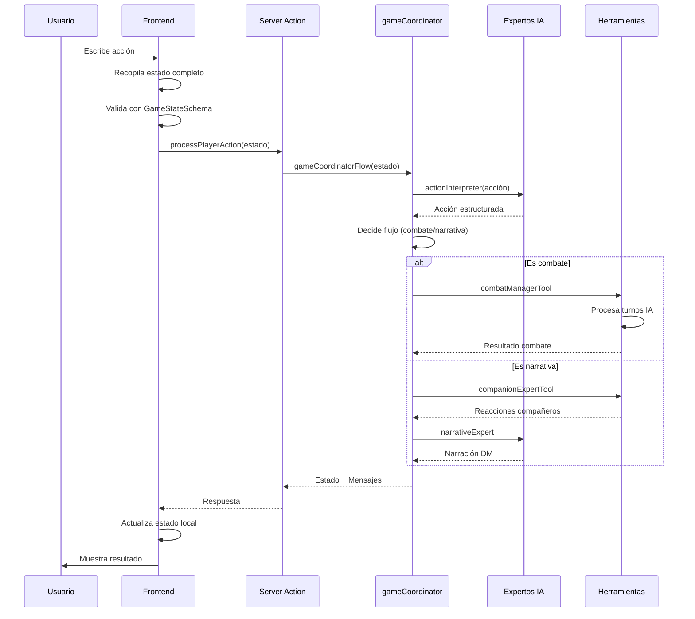
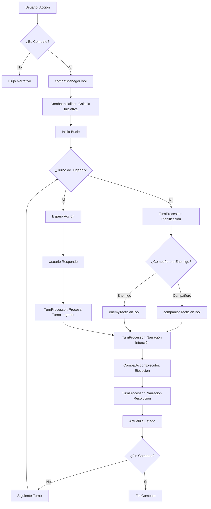

# Flujo de Datos Detallado

Este documento describe en detalle cómo fluyen los datos a través del sistema, desde la interacción del usuario hasta la respuesta final.

## Flujo General de una Acción



## Flujo de Exploración (Fuera de Combate)

### 1. Usuario Envía Acción

```
Usuario: "Vamos a la posada"
```

### 2. Frontend Recopila Estado

```typescript
// En game-view.tsx, handleSendMessage
const actionInput = {
  playerAction: "Vamos a la posada",
  party: party,                    // Array completo de personajes
  locationId: locationId,          // ID de ubicación actual
  inCombat: false,                 // No estamos en combate
  turnIndex: 0,                    // No aplica fuera de combate
  initiativeOrder: [],              // Vacío fuera de combate
  conversationHistory: messages.slice(-10) // Últimos 10 mensajes
};
```

### 3. Validación en Frontend

```typescript
// Valida antes de enviar
const validatedState = GameStateSchema.parse(actionInput);
```

### 4. Server Action

```typescript
// app/actions.ts
export async function processPlayerAction(state: GameState) {
  const result = await gameCoordinatorFlow(state);
  return result;
}
```

### 5. gameCoordinator Procesa

```typescript
// ai/flows/game-coordinator.ts
1. Recibe el estado completo
2. Carga datos de la aventura
3. Si inCombat === false:
   a. Llama a actionInterpreter
   b. Interpreta la acción
   c. Si es ataque → inicia combate
   d. Si no → flujo narrativo
```

### 6. Flujo Narrativo

```typescript
// gameCoordinator continúa...
1. Decide qué compañeros deben reaccionar
2. Para cada compañero:
   - Llama a companionExpertTool({
       party: party,
       characterName: "Elara",
       context: "El jugador quiere ir a la posada",
       inCombat: false
     })
   - Recibe diálogo del compañero
3. Llama a narrativeExpert({
     action: interpretación,
     locationContext: datos de ubicación,
     party: party,
     conversationHistory: historial
   })
4. Recibe narración del DM
5. Ensambla mensajes: [reacciones..., narración]
```

### 7. Respuesta al Frontend

```typescript
{
  messages: [
    { sender: 'Character', senderName: 'Elara', content: 'Me parece bien...' },
    { sender: 'DM', content: 'Os dirigís a la Posada Rocacolina...' }
  ],
  party: party,              // Actualizado si hay cambios
  locationId: 'posada-id',   // Nueva ubicación
  inCombat: false,
  diceRolls: []             // Si hubo tiradas
}
```

### 8. Frontend Actualiza UI

```typescript
// game-view.tsx
setMessages([...messages, ...newMessages]);
setLocationId(newLocationId);
// React re-renderiza automáticamente todos los componentes
```

## Flujo de Combate

### 1. Inicio de Combate

```
Usuario: "Ataco al orco"
```

### 2. gameCoordinator Detecta Ataque

```typescript
// actionInterpreter devuelve: { actionType: 'attack', targetId: 'orco-1' }
// gameCoordinator llama a combatInitiationExpertTool
```

### 3. Iniciación de Combate

```typescript
combatInitiationExpertTool({
  playerAction: "Ataco al orco",
  locationId: "plaza",
  locationContext: datos de la plaza,
  party: party
})
// Devuelve: { shouldInitiate: true, enemies: [...] }
```

### 4. combatManagerTool Toma Control

```typescript
combatManagerTool({
  ...estado,
  inCombat: true,
  turnIndex: 0
})
```

### 5. Cálculo de Iniciativa

```typescript
1. Calcula iniciativa para cada combatiente (party + enemigos)
2. Ordena por iniciativa (mayor a menor)
3. Crea initiativeOrder: [
     { id: 'player-1', name: 'Galador', initiative: 18 },
     { id: 'enemy-1', name: 'Orco', initiative: 15 },
     ...
   ]
```

### 6. Bucle de Turnos (Simplificado - Issue #117)

El procesamiento de turnos ahora es unificado usando `TurnProcessor`:

```typescript
// CombatSession procesa turnos usando TurnProcessor (unificado)
while (turnIndex < initiativeOrder.length) {
  const currentCombatant = initiativeOrder[turnIndex];
  
  if (currentCombatant.controlledBy === 'Player') {
    // Cede control al jugador
    break;
  }
  
  // Para IA (compañeros y enemigos), TurnProcessor maneja todo:
  // 1. Si es IA, consulta al tactician correspondiente
  // 2. Genera narración de intención
  // 3. Ejecuta acción usando CombatActionExecutor
  // 4. Genera narración de resolución
  await TurnProcessor.processTurn({
    combatant: currentCombatant,
    // ... contexto y dependencias
  });
  
  turnIndex++;
}
```

**Flujo Unificado de TurnProcessor:**
1. **Planificación**: 
   - Si IA: Consulta `companionTacticianTool` o `enemyTacticianTool`
   - Si Jugador: Usa `interpretedAction`
2. **Narración de Intención**: Llama a `combatNarrationExpertTool` (tipo: 'intention')
3. **Ejecución**: Llama a `CombatActionExecutor.execute()` que:
   - Procesa tiradas de ataque/daño
   - Aplica resultados usando `RulesEngine`
   - Retorna resultados estructurados
4. **Narración de Resolución**: Llama a `combatNarrationExpertTool` (tipo: 'resolution')

### 7. Turno del Jugador

```typescript
// El bucle se detiene cuando es turno del jugador
// Se devuelve el estado con turnIndex apuntando al jugador
// El frontend muestra la UI de combate esperando la acción del jugador
```

### 8. Continuación del Combate

```
Usuario: "Ataco con mi espada"
→ actionInterpreter interpreta la acción
→ combatManagerTool procesa el turno usando CombatSession
→ CombatSession delega a TurnProcessor.processTurn()
→ TurnProcessor procesa el turno del jugador:
   1. Usa interpretedAction (ya planificado)
   2. Genera narración de intención
   3. Ejecuta acción usando CombatActionExecutor
   4. Genera narración de resolución
→ Después de procesar, el bucle continúa con el siguiente combatiente
```

**Nota**: Tanto el turno del jugador como el de la IA usan el mismo flujo unificado a través de `TurnProcessor`, garantizando consistencia.

## Flujo de Guardado y Carga

### Guardado

```typescript
// app/page.tsx
const saveData = {
  party: party,
  messages: messages,
  diceRolls: diceRolls,
  locationId: locationId,
  inCombat: inCombat,
  initiativeOrder: initiativeOrder,
  turnIndex: turnIndex
};
localStorage.setItem('dnd-adventure-save', JSON.stringify(saveData));
```

### Carga

```typescript
// app/page.tsx
const savedData = localStorage.getItem('dnd-adventure-save');
if (savedData) {
  const gameState = JSON.parse(savedData);
  // Pasa a game-view.tsx como initialData
}
```

## Flujo de Tiradas de Dados

### Tirada Manual del Jugador

```
Usuario: Hace clic en el dado d20
```

```typescript
// DiceRoller component
1. Usuario selecciona tipo de dado
2. Opcionalmente añade modificador
3. Calcula resultado localmente
4. Añade a diceRolls state
5. Muestra en DiceLogPanel
```

### Tirada Automática (Combate)

```
IA decide: "Elara ataca con su bastón"
```

```typescript
// companionTacticianTool devuelve:
{
  actionDescription: "Lanzar Rayo de Escarcha",
  targetId: "enemy-1",
  diceRolls: [
    {
      roller: "Elara",
      rollNotation: "1d20+5",
      description: "Attack Roll"
    },
    {
      roller: "Elara",
      rollNotation: "1d8+3",
      description: "Damage Roll"
    }
  ]
}

// TurnProcessor procesa (flujo unificado):
1. Planificación: Ya recibida del tactician
2. Narración de Intención: Llama a combatNarrationExpertTool (tipo: 'intention')
3. Ejecución: Llama a CombatActionExecutor.execute() que:
   - Procesa cada tirada usando diceRollerTool
   - Compara ataque con AC
   - Aplica daño usando RulesEngine
   - Retorna resultados estructurados
4. Narración de Resolución: Llama a combatNarrationExpertTool (tipo: 'resolution')
5. Retorna: Mensajes (intención + resolución), diceRolls, estado actualizado
```

## Flujo de Validación de Datos

### Frontend → Backend

```typescript
// Frontend valida antes de enviar
GameStateSchema.parse(actionInput)
  ✅ Pasa → Envía al servidor
  ❌ Falla → Error en consola, no envía
```

### Backend Recibe

```typescript
// gameCoordinator valida entrada
GameStateSchema.parse(input)
  ✅ Pasa → Procesa
  ❌ Falla → Error, devuelve mensaje de error
```

### Backend → Frontend

```typescript
// Backend valida salida
GameCoordinatorOutputSchema.parse(output)
  ✅ Pasa → Devuelve al frontend
  ❌ Falla → Error interno
```

## Diagrama de Flujo Completo de Combate (Simplificado - Issue #117)



**Nota**: El flujo ahora es unificado - tanto jugador como IA usan `TurnProcessor` y `CombatActionExecutor`, eliminando duplicación y garantizando consistencia.

## Consideraciones de Rendimiento

### Optimizaciones Implementadas

1. **Validación Temprana:** Se valida en el frontend antes de enviar
2. **Estado Mínimo:** Solo se envía el estado necesario
3. **Historial Limitado:** Solo últimos 10 mensajes en conversationHistory
4. **Lazy Loading:** Componentes se cargan solo cuando se necesitan

### Puntos de Mejora Futura

1. **Streaming:** Enviar mensajes uno por uno en lugar de todos a la vez
2. **Caché:** Cachear datos de aventura que no cambian
3. **Debouncing:** Evitar múltiples llamadas simultáneas

