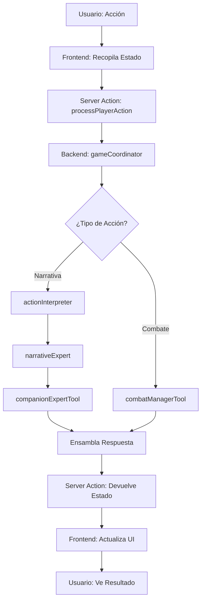

# Visión General de la Arquitectura

Este documento proporciona una visión de alto nivel de la arquitectura del proyecto D&D Adventures AI.

## Modelo Cliente-Servidor Desacoplado

El proyecto sigue un modelo cliente-servidor claramente separado:

```
┌─────────────────┐         ┌─────────────────┐
│   Frontend      │         │    Backend      │
│   (Next.js)     │◄───────►│   (Genkit IA)   │
│                 │         │                 │
│ - React UI      │         │ - Flujos IA     │
│ - Estado Local  │         │ - Herramientas  │
│ - Componentes  │         │ - Lógica Juego  │
└─────────────────┘         └─────────────────┘
```

### Frontend (Cliente)

- **Framework:** Next.js 15.3.3 con App Router
- **Lenguaje:** TypeScript
- **UI:** React 18.3.1 + shadcn/ui + Tailwind CSS
- **Estado:** React Hooks (`useState`, `useCallback`)
- **Responsabilidad:** Renderización de UI y gestión de estado local

### Backend (Servidor)

- **Framework:** Genkit 1.20.0
- **IA:** Google Gemini 2.5 Flash
- **Comunicación:** Next.js Server Actions
- **Responsabilidad:** Lógica del juego, toma de decisiones y generación de narrativa

## Flujo de Comunicación

```
Usuario → Frontend → Server Action → Backend IA → Respuesta → Frontend → Usuario
```

1. **Usuario envía acción** a través de la interfaz
2. **Frontend** recopila el estado completo y lo envía al backend
3. **Server Action** (`processPlayerAction`) actúa como puente seguro
4. **Backend IA** procesa la acción y genera respuesta
5. **Frontend** actualiza el estado local con la respuesta
6. **Usuario** ve el resultado en la interfaz

## Principios Arquitectónicos

### 1. Separación de Responsabilidades

- **Frontend:** Solo renderización y gestión de estado local
- **Backend:** Solo lógica del juego y generación de contenido
- **Comunicación:** A través de Server Actions (tipo-seguro)

### 2. Estado Descentralizado

- **Frontend:** Estado local en React (`game-view.tsx`)
- **Backend:** Sin estado global (stateless)
- **Datos:** Se pasan explícitamente en cada llamada

### 3. Modularidad

- **Flujos de IA:** Expertos especializados (interpretar, narrar, combatir)
- **Herramientas:** Funciones reutilizables
- **Componentes:** Componentes "tontos" que solo renderizan

### 4. Validación Robusta

- **Esquemas Zod:** Validación de datos en tiempo de ejecución
- **TypeScript:** Validación de tipos en tiempo de compilación
- **Fuente única de verdad:** Esquemas centralizados

## Componentes Principales

### Frontend

- **`app/game-view.tsx`:** Orquestador principal del estado
- **`components/game/`:** Componentes del juego (ChatPanel, CharacterSheet, etc.)
- **`components/layout/`:** Componentes de layout (LeftPanel, AppHeader)
- **`app/actions.ts`:** Server Actions para comunicación con backend

### Backend

- **`ai/flows/game-coordinator.ts`:** Orquestador lógico del juego
- **`ai/flows/action-interpreter.ts`:** Interpreta acciones del jugador
- **`ai/flows/narrative-expert.ts`:** Genera narrativa
- **`ai/tools/`:** Herramientas especializadas (combate, dados, etc.)

## Flujo de un Turno Típico



## Gestión de Datos

### Estado del Juego

El estado completo del juego se mantiene en el frontend y se envía al backend en cada acción:

```typescript
{
  playerAction: string,        // Acción del jugador
  party: Character[],          // Personajes del grupo
  locationId: string,          // Ubicación actual
  inCombat: boolean,           // Estado de combate
  turnIndex: number,           // Turno actual (combate)
  initiativeOrder: Combatant[], // Orden de iniciativa
  conversationHistory: Message[] // Historial reciente
}
```

### Validación

- **Frontend:** Valida antes de enviar (`GameStateSchema`)
- **Backend:** Valida al recibir (esquemas de entrada)
- **Salida:** Valida antes de devolver (esquemas de salida)

## Ventajas de esta Arquitectura

1. **Escalabilidad:** Fácil añadir nuevas funcionalidades
2. **Mantenibilidad:** Código organizado y modular
3. **Depuración:** Logs claros y trazabilidad
4. **Extensibilidad:** Fácil añadir nuevos flujos o herramientas
5. **Robustez:** Validación en múltiples capas

## Documentación Relacionada

- [Arquitectura del Frontend](./arquitectura-frontend.md) - Detalles del cliente
- [Arquitectura del Backend IA](./arquitectura-backend.md) - Detalles del servidor
- [Flujo de Datos](./flujo-datos.md) - Diagramas detallados
- [Referencia API](./referencia-api.md) - Contratos de datos

