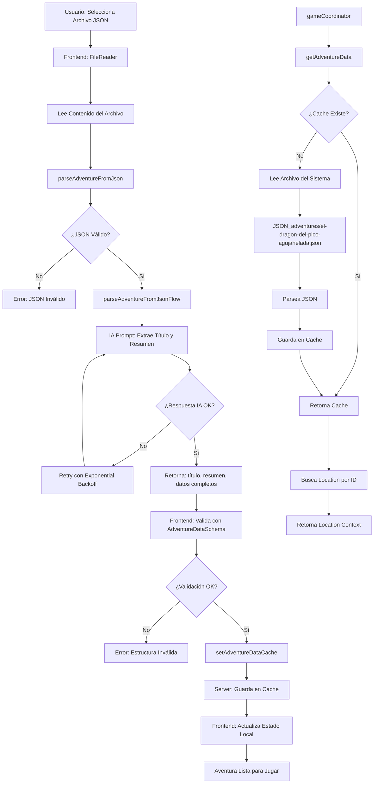
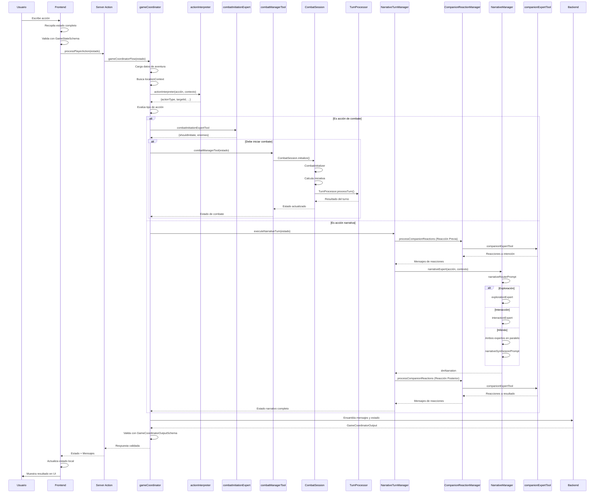

# Visión General de la Arquitectura

Este documento proporciona una visión de alto nivel de la arquitectura del proyecto D&D Adventures AI.

## Modelo Cliente-Servidor Desacoplado

El proyecto sigue un modelo cliente-servidor claramente separado:

```
┌─────────────────┐         ┌─────────────────┐
│   Frontend      │         │    Backend      │
│   (Next.js)     │◄───────►│   (Genkit IA)   │
│                 │         │                 │
│ - React UI      │         │ - Flujos IA     │
│ - Estado Local  │         │ - Herramientas  │
│ - Componentes  │         │ - Lógica Juego  │
└─────────────────┘         └─────────────────┘
```

### Frontend (Cliente)

- **Framework:** Next.js 15.5.6 con App Router
- **Lenguaje:** TypeScript
- **UI:** React 18.3.1 + shadcn/ui + Tailwind CSS
- **Estado:** React Hooks (`useState`, `useCallback`)
- **Responsabilidad:** Renderización de UI y gestión de estado local

### Backend (Servidor)

- **Framework:** Genkit 1.20.0
- **IA:** Google Gemini 2.5 Flash
- **Comunicación:** Next.js Server Actions
- **Responsabilidad:** Lógica del juego, toma de decisiones y generación de narrativa
- **Arquitectura de Combate:** `CombatSession` (patrón State Object) encapsula todo el estado del combate

## Flujo de Comunicación

```
Usuario → Frontend → Server Action → Backend IA → Respuesta → Frontend → Usuario
```

1. **Usuario envía acción** a través de la interfaz
2. **Frontend** recopila el estado completo y lo envía al backend
3. **Server Action** (`processPlayerAction`) actúa como puente seguro
4. **Backend IA** procesa la acción y genera respuesta
5. **Frontend** actualiza el estado local con la respuesta
6. **Usuario** ve el resultado en la interfaz

## Principios Arquitectónicos

### 1. Separación de Responsabilidades

- **Frontend:** Solo renderización y gestión de estado local
- **Backend:** Solo lógica del juego y generación de contenido
- **Comunicación:** A través de Server Actions (tipo-seguro)

### 2. Estado Descentralizado

- **Frontend:** Estado local en React (`game-view.tsx`)
- **Backend:** Sin estado global (stateless)
- **Datos:** Se pasan explícitamente en cada llamada

### 3. Modularidad

- **Flujos de IA:** Expertos especializados (interpretar, narrar, combatir)
- **Herramientas:** Funciones reutilizables
- **Componentes:** Componentes "tontos" que solo renderizan

### 4. Validación Robusta

- **Esquemas Zod:** Validación de datos en tiempo de ejecución
- **TypeScript:** Validación de tipos en tiempo de compilación
- **Fuente única de verdad:** Esquemas centralizados

## Componentes Principales

### Frontend

- **`app/game-view.tsx`:** Orquestador principal del estado
- **`components/game/`:** Componentes del juego (ChatPanel, CharacterSheet, etc.)
- **`components/layout/`:** Componentes de layout (LeftPanel, AppHeader)
- **`app/actions.ts`:** Server Actions para comunicación con backend

### Backend

- **`ai/flows/game-coordinator.ts`:** Orquestador lógico del juego (simplificado, delega a managers)
- **`ai/flows/managers/`:** Managers especializados:
  - **`companion-reaction-manager.ts`:** Gestiona reacciones de compañeros (antes y después del DM)
  - **`narrative-turn-manager.ts`:** Orquesta el flujo narrativo completo
- **`ai/flows/action-interpreter.ts`:** Interpreta acciones del jugador
- **`ai/flows/narrative-manager.ts`:** Genera narrativa (narrativeExpert)
- **`ai/tools/`:** Herramientas especializadas (combate, dados, etc.)
- **`lib/combat/combat-session.ts`:** Clase principal que encapsula el estado del combate (patrón State Object)
- **`lib/combat/`:** Módulos especializados de combate (rules-engine, turn-manager, turn-processor, action-executor, combat-session, etc.)
- **`lib/game/entity-status-utils.ts`:** Utilidades centralizadas para verificación de estados de entidades
- **`lib/utils/transcript-formatter.ts`:** Utilidad para formatear historial de conversación

## Flujo de un Turno Típico

```mermaid
graph TD
    A[Usuario: Acción] --> B[Frontend: Recopila Estado]
    B --> C[Server Action: processPlayerAction]
    C --> D[Backend: gameCoordinator]
    D --> E[actionInterpreter]
    E --> F{¿Tipo de Acción?}
    F -->|Combate| G[combatManagerTool]
    G --> G1[CombatSession]
    G1 --> G2[Inicializar/Procesar Turno]
    F -->|Narrativa| H[NarrativeTurnManager]
    H --> I[CompanionReactionManager<br/>(Reacción Previa)]
    I --> J[narrativeExpert<br/>(DM Narration)]
    J --> K[CompanionReactionManager<br/>(Reacción Posterior)]
    K --> L[Ensambla Respuesta]
    G --> L
    L --> M[Server Action: Devuelve Estado]
    M --> N[Frontend: Actualiza UI]
    N --> O[Usuario: Ve Resultado]
```

## Diagramas Detallados del Sistema

### Sistema de Combate Completo

El sistema de combate utiliza `CombatSession` (patrón State Object) para encapsular todo el estado del combate. El flujo completo desde la detección hasta el procesamiento de turnos:

```mermaid
graph TD
    A[Usuario: Acción de Combate<br/>Ej: 'Ataco al orco'] --> B[gameCoordinator]
    B --> C[actionInterpreter]
    C --> D{¿Acción es Ataque?}
    D -->|Sí| E[combatInitiationExpertTool]
    E --> F{¿Iniciar Combate?}
    F -->|Sí| G[combatManagerTool]
    F -->|No| H[Flujo Narrativo]
    
    G --> I{¿Ya en Combate?}
    I -->|No| J[CombatSession.initialize]
    I -->|Sí| K[CombatSession.processCurrentTurn]
    
    subgraph Fase de Inicialización
    J --> L[CombatInitializer]
    L --> M[Valida Enemigos & Calcula Iniciativa]
    M --> N[Establece Orden de Turnos]
    end
    
    N --> O[CombatSession: Bucle de Turnos]
    K --> O
    
    O --> P{¿Turno de Jugador?}
    P -->|Sí| Q[Espera Acción del Jugador]
    P -->|No| R[TurnProcessor.processTurn]
    
    R --> S{¿Tipo de IA?}
    S -->|Compañero| T[companionTacticianTool]
    S -->|Enemigo| U[enemyTacticianTool]
    
    T --> V[Planificación de Acción]
    U --> V
    
    V --> W[CombatActionExecutor.execute]
    W --> X[Procesa Tiradas & Aplica Daño]
    X --> Y[combatNarrationExpertTool]
    
    Y --> Z[Genera Narración Completa]
    Z --> AA{¿Fin Combate?}
    AA -->|No| AB[CombatSession.advanceTurn]
    AB --> O
    AA -->|Sí| AC[Fin Combate]
    
    Q --> AD[Usuario Responde]
    AD --> AE[actionInterpreter]
    AE --> AF[TurnProcessor (Jugador)]
    AF --> W
    
    AC --> AG[Devuelve Estado Actualizado]
    H --> AG
    AG --> AH[Frontend: Actualiza UI]
```

**Componentes Clave del Sistema de Combate:**
- **CombatSession**: Encapsula todo el estado del combate (turnIndex, party, enemies, initiativeOrder)
- **CombatInitializer**: Inicializa el combate (valida enemigos, calcula iniciativa, ordena turnos)
- **TurnProcessor**: Procesa turnos de forma unificada (jugador e IA) - planifica, ejecuta y genera narración
- **CombatActionExecutor**: Ejecuta acciones de combate (procesa tiradas, aplica daño con RulesEngine)
- **Tacticians**: Deciden acciones para IA (companionTacticianTool, enemyTacticianTool) - solo lógica táctica, sin narración
- **combatNarrationExpertTool**: Genera una única narración completa que incluye preparación, ejecución y resultado (ya no hay narraciones de intención y resolución separadas)

### Carga de Aventuras desde JSON

El sistema permite cargar aventuras desde archivos JSON. El proceso incluye validación, parsing con IA y caché en el servidor:



**Componentes Clave de Carga de Aventuras:**
- **parseAdventureFromJson**: Flujo de IA que extrae título y resumen del JSON
- **setAdventureDataCache**: Guarda la aventura en caché del servidor
- **getAdventureData**: Obtiene datos de aventura (usa caché o lee archivo)
- **AdventureDataSchema**: Valida la estructura de datos de la aventura

### Flujo Narrativo (Exploración e Interacción)

Cuando el jugador no está en combate, el `gameCoordinator` orquesta la narrativa y las reacciones de los compañeros:

```mermaid
graph TD
    A[Usuario: Acción Narrativa] --> B[gameCoordinator]
    B --> C[actionInterpreter]
    C --> D{¿Es Combate?}
    D -->|No| E[NarrativeTurnManager]
    D -->|Sí| F[Sistema de Combate]
    
    E --> G[CompanionReactionManager]
    G --> H{¿Compañeros Vivos?}
    H -->|Sí| I[companionExpertTool: Reacción a Intención]
    H -->|No| J[Salta Reacciones]
    
    I --> K[narrativeExpert (NarrativeManager)]
    J --> K
    
    K --> L[narrativeRouterPrompt]
    L --> M{¿Tipo de Acción?}
    
    M -->|EXPLORATION| N[explorationExpert]
    M -->|INTERACTION| O[interactionExpert]
    M -->|HYBRID| P[Ambos en Paralelo]
    
    N --> Q[Genera Descripción Ambiental]
    O --> R[Genera Diálogo NPC]
    
    P --> S[narrativeSynthesizerPrompt]
    S --> T[Combina Resultados]
    
    Q --> U[dmNarration]
    R --> U
    T --> U
    
    U --> V[CompanionReactionManager]
    V --> W{¿Compañeros Vivos?}
    W -->|Sí| X[companionExpertTool: Reacción a Resultado]
    W -->|No| Y[Salta Reacciones]
    
    X --> Z[Ensambla Mensajes Finales]
    Y --> Z
    Z --> AA[Frontend: Actualiza UI]
```

**Componentes Clave del Flujo Narrativo:**
- **gameCoordinator**: Orquestador principal que delega el flujo narrativo al NarrativeTurnManager.
- **NarrativeTurnManager**: Encapsula todo el flujo narrativo (movimiento, reacciones, narración).
- **CompanionReactionManager**: Gestiona las reacciones de compañeros (antes y después del DM).
- **EntityStatusUtils**: Utilidades centralizadas para verificar estados (vivo/muerto/consciente).
- **NarrativeManager (narrativeExpert)**: Orquestador que decide qué expertos usar (Exploración/Interacción).
- **explorationExpert**: Genera descripciones ambientales y gestiona movimiento.
- **interactionExpert**: Gestiona diálogos con NPCs y tiradas sociales.
- **companionExpertTool**: Genera reacciones de compañeros. Se llama dos veces: antes (reacción a la intención) y después (reacción a lo sucedido).

### Flujo Detallado de una Acción del Jugador

Secuencia completa desde que el usuario envía una acción hasta que recibe la respuesta:



## Gestión de Datos

### Estado del Juego

El estado completo del juego se mantiene en el frontend y se envía al backend en cada acción:

```typescript
{
  playerAction: string,        // Acción del jugador
  party: Character[],          // Personajes del grupo
  locationId: string,          // Ubicación actual
  inCombat: boolean,           // Estado de combate
  turnIndex: number,           // Turno actual (combate)
  initiativeOrder: Combatant[], // Orden de iniciativa
  conversationHistory: Message[] // Historial reciente
}
```

### Validación

- **Frontend:** Valida antes de enviar (`GameStateSchema`)
- **Backend:** Valida al recibir (esquemas de entrada)
- **Salida:** Valida antes de devolver (esquemas de salida)

## Ventajas de esta Arquitectura

1. **Escalabilidad:** Fácil añadir nuevas funcionalidades
2. **Mantenibilidad:** Código organizado y modular
3. **Depuración:** Logs claros y trazabilidad
4. **Extensibilidad:** Fácil añadir nuevos flujos o herramientas
5. **Robustez:** Validación en múltiples capas

## Documentación Relacionada

- [Arquitectura del Frontend](./arquitectura-frontend.md) - Detalles del cliente
- [Arquitectura del Backend IA](./arquitectura-backend.md) - Detalles del servidor
- [Flujo de Datos](./flujo-datos.md) - Diagramas detallados
- [Referencia API](./referencia-api.md) - Contratos de datos
- [CombatSession - Guía de Uso](./combat-session-guia.md) - Guía completa de uso de CombatSession
- [CombatSession - Diseño](./combat-session-design.md) - Diseño detallado y decisiones arquitectónicas

