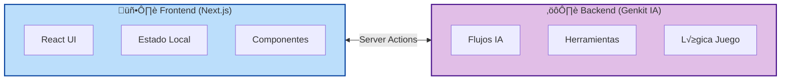
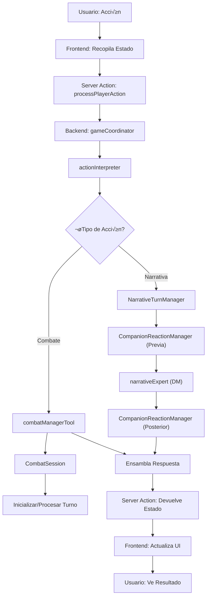
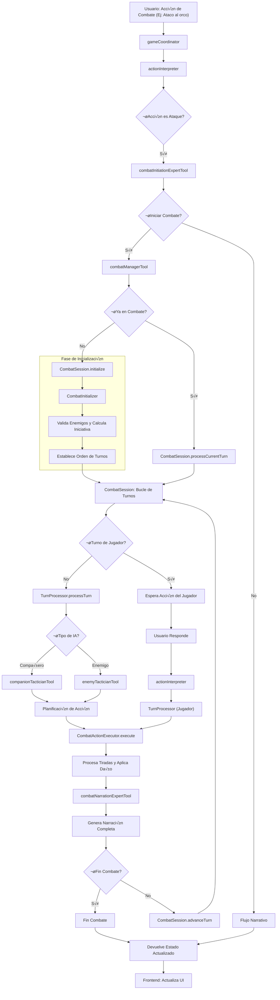
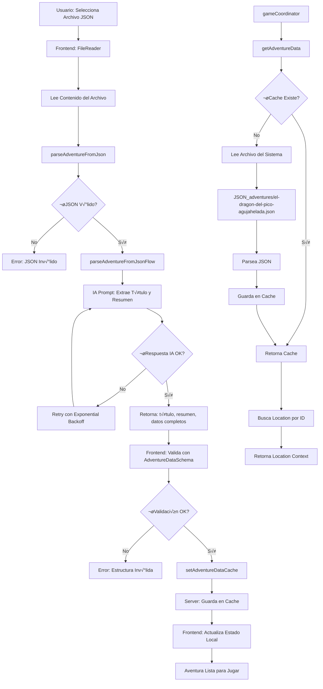
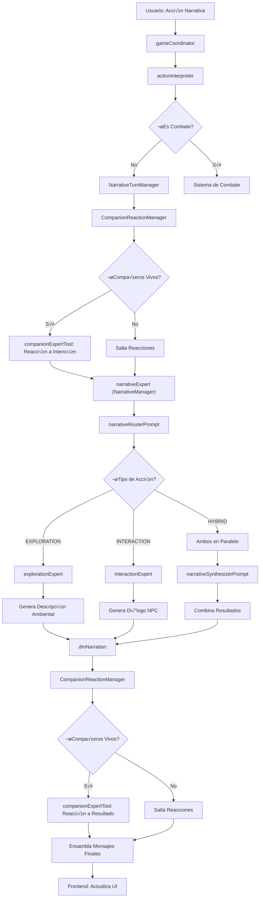
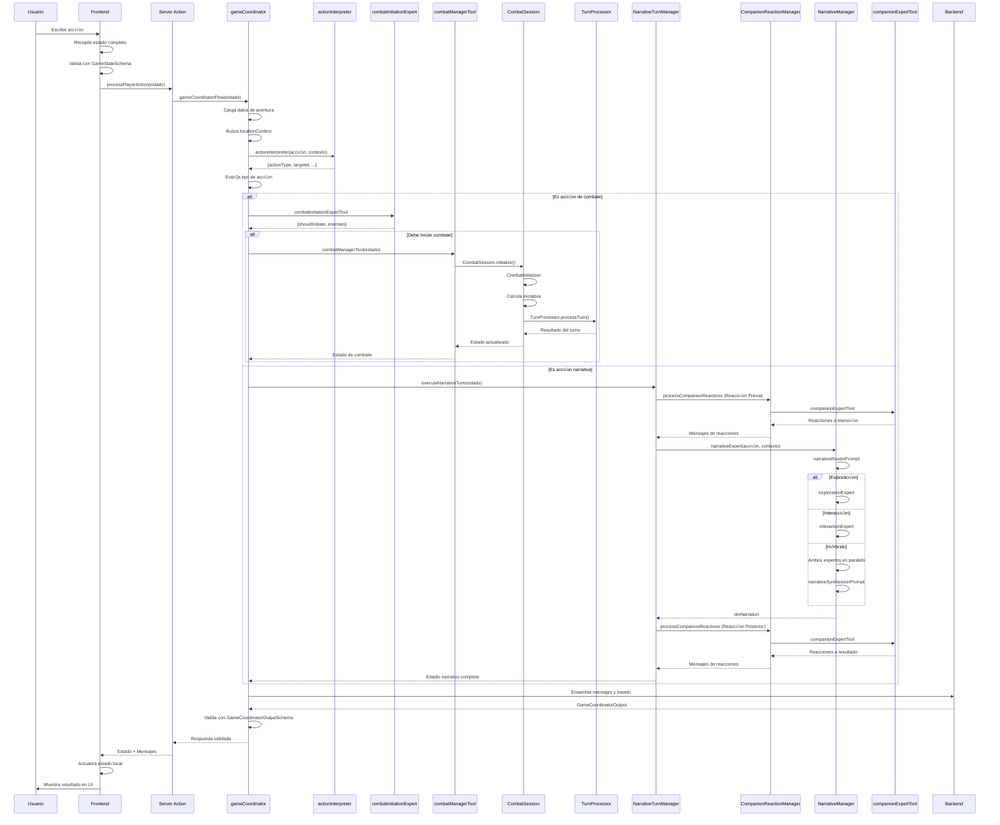

# Visión General de la Arquitectura

Este documento proporciona una visión de alto nivel de la arquitectura del proyecto D&D Adventures AI.

## Modelo Cliente-Servidor Desacoplado

El proyecto sigue un modelo cliente-servidor claramente separado:


```mermaid
graph LR
    subgraph Frontend["🖥️ Frontend (Next.js)"]
        A[React UI]
        B[Estado Local]
        C[Componentes]
    end
    
    subgraph Backend["⚙️ Backend (Genkit IA)"]
        D[Flujos IA]
        E[Herramientas]
        F[Lógica Juego]
    end
    
    Frontend <-->|Server Actions| Backend
    
    style Frontend fill:#bbdefb,stroke:#0d47a1,stroke-width:2px
    style Backend fill:#e1bee7,stroke:#4a148c,stroke-width:2px
```

### Frontend (Cliente)

- **Framework:** Next.js 15.5.6 con App Router
- **Lenguaje:** TypeScript
- **UI:** React 18.3.1 + shadcn/ui + Tailwind CSS
- **Estado:** React Hooks (`useState`, `useCallback`)
- **Responsabilidad:** Renderización de UI y gestión de estado local

### Backend (Servidor)

- **Framework:** Genkit 1.20.0
- **IA:** Google Gemini 2.5 Flash
- **Comunicación:** Next.js Server Actions
- **Responsabilidad:** Lógica del juego, toma de decisiones y generación de narrativa
- **Arquitectura de Combate:** `CombatSession` (patrón State Object) encapsula todo el estado del combate

## Flujo de Comunicación

```
Usuario ‚Üí Frontend ‚Üí Server Action ‚Üí Backend IA ‚Üí Respuesta ‚Üí Frontend ‚Üí Usuario
```

1. **Usuario envía acción** a través de la interfaz
2. **Frontend** recopila el estado completo y lo envía al backend
3. **Server Action** (`processPlayerAction`) act√∫a como puente seguro
4. **Backend IA** procesa la acción y genera respuesta
5. **Frontend** actualiza el estado local con la respuesta
6. **Usuario** ve el resultado en la interfaz

## Principios Arquitectónicos

### 1. Separación de Responsabilidades

- **Frontend:** Solo renderización y gestión de estado local
- **Backend:** Solo lógica del juego y generación de contenido
- **Comunicación:** A través de Server Actions (tipo-seguro)

### 2. Estado Descentralizado

- **Frontend:** Estado local en React (`game-view.tsx`)
- **Backend:** Sin estado global (stateless)
- **Datos:** Se pasan explícitamente en cada llamada

### 3. Modularidad

- **Flujos de IA:** Expertos especializados (interpretar, narrar, combatir)
- **Herramientas:** Funciones reutilizables
- **Componentes:** Componentes "tontos" que solo renderizan

### 4. Validación Robusta

- **Esquemas Zod:** Validación de datos en tiempo de ejecución
- **TypeScript:** Validación de tipos en tiempo de compilación
- **Fuente √∫nica de verdad:** Esquemas centralizados

## Componentes Principales

### Frontend

- **`app/game-view.tsx`:** Orquestador principal del estado
- **`components/game/`:** Componentes del juego (ChatPanel, CharacterSheet, etc.)
- **`components/layout/`:** Componentes de layout (LeftPanel, AppHeader)
- **`app/actions.ts`:** Server Actions para comunicación con backend

### Backend

- **`ai/flows/game-coordinator.ts`:** Orquestador lógico del juego (simplificado, delega a managers)
- **`ai/flows/managers/`:** Managers especializados:
  - **`companion-reaction-manager.ts`:** Gestiona reacciones de compañeros (antes y después del DM)
  - **`narrative-turn-manager.ts`:** Orquesta el flujo narrativo completo
- **`ai/flows/action-interpreter.ts`:** Interpreta acciones del jugador
- **`ai/flows/narrative-manager.ts`:** Genera narrativa (narrativeExpert)
- **`ai/tools/`:** Herramientas especializadas (combate, dados, etc.)
- **`lib/combat/combat-session.ts`:** Clase principal que encapsula el estado del combate (patrón State Object)
- **`lib/combat/`:** Módulos especializados de combate (rules-engine, turn-manager, turn-processor, action-executor, combat-session, etc.)
- **`lib/game/entity-status-utils.ts`:** Utilidades centralizadas para verificación de estados de entidades
- **`lib/utils/transcript-formatter.ts`:** Utilidad para formatear historial de conversación

## Flujo de un Turno Típico


```mermaid
graph TD
    A[Usuario: Acción] --> B[Frontend: Recopila Estado]
    B --> C[Server Action: processPlayerAction]
    C --> D[Backend: gameCoordinator]
    D --> E[actionInterpreter]
    E --> F{¿Tipo de Acción?}
    F -->|Combate| G[combatManagerTool]
    G --> G1[CombatSession]
    G1 --> G2[Inicializar/Procesar Turno]
    F -->|Narrativa| H[NarrativeTurnManager]
    H --> I["CompanionReactionManager (Previa)"]
    I --> J["narrativeExpert (DM)"]
    J --> K["CompanionReactionManager (Posterior)"]
    K --> L[Ensambla Respuesta]
    G --> L
    L --> M[Server Action: Devuelve Estado]
    M --> N[Frontend: Actualiza UI]
    N --> O[Usuario: Ve Resultado]
```

## Diagramas Detallados del Sistema

### Sistema de Combate Completo

El sistema de combate utiliza `CombatSession` (patrón State Object) para encapsular todo el estado del combate. El flujo completo desde la detección hasta el procesamiento de turnos:


```mermaid
graph TD
    A["Usuario: Acción de Combate (Ej: Ataco al orco)"] --> B[gameCoordinator]
    B --> C[actionInterpreter]
    C --> D{¿Acción es Ataque?}
    D -->|Sí| E[combatInitiationExpertTool]
    E --> F{¬øIniciar Combate?}
    F -->|Sí| G[combatManagerTool]
    F -->|No| H[Flujo Narrativo]
    
    G --> I{¬øYa en Combate?}
    I -->|No| J[CombatSession.initialize]
    I -->|Sí| K[CombatSession.processCurrentTurn]
    
    subgraph "Fase de Inicialización"
    J --> L[CombatInitializer]
    L --> M["Valida Enemigos y Calcula Iniciativa"]
    M --> N[Establece Orden de Turnos]
    end
    
    N --> O["CombatSession: Bucle de Turnos"]
    K --> O
    
    O --> P{¬øTurno de Jugador?}
    P -->|Sí| Q[Espera Acción del Jugador]
    P -->|No| R[TurnProcessor.processTurn]
    
    R --> S{¬øTipo de IA?}
    S -->|Compañero| T[companionTacticianTool]
    S -->|Enemigo| U[enemyTacticianTool]
    
    T --> V["Planificación de Acción"]
    U --> V
    
    V --> W[CombatActionExecutor.execute]
    W --> X["Procesa Tiradas y Aplica Daño"]
    X --> Y[combatNarrationExpertTool]
    
    Y --> Z["Genera Narración Completa"]
    Z --> AA{¬øFin Combate?}
    AA -->|No| AB[CombatSession.advanceTurn]
    AB --> O
    AA -->|Sí| AC[Fin Combate]
    
    Q --> AD[Usuario Responde]
    AD --> AE[actionInterpreter]
    AE --> AF["TurnProcessor (Jugador)"]
    AF --> W
    
    AC --> AG[Devuelve Estado Actualizado]
    H --> AG
    AG --> AH[Frontend: Actualiza UI]
```

**Componentes Clave del Sistema de Combate:**
- **CombatSession**: Encapsula todo el estado del combate (turnIndex, party, enemies, initiativeOrder)
- **CombatInitializer**: Inicializa el combate (valida enemigos, calcula iniciativa, ordena turnos)
- **TurnProcessor**: Procesa turnos de forma unificada (jugador e IA) - planifica, ejecuta y genera narración
- **CombatActionExecutor**: Ejecuta acciones de combate (procesa tiradas, aplica daño con RulesEngine)
- **Tacticians**: Deciden acciones para IA (companionTacticianTool, enemyTacticianTool) - solo lógica táctica, sin narración
- **combatNarrationExpertTool**: Genera una única narración completa que incluye preparación, ejecución y resultado (ya no hay narraciones de intención y resolución separadas)

### Carga de Aventuras desde JSON

El sistema permite cargar aventuras desde archivos JSON. El proceso incluye validación, parsing con IA y caché en el servidor:


```mermaid
graph TD
    A[Usuario: Selecciona Archivo JSON] --> B[Frontend: FileReader]
    B --> C[Lee Contenido del Archivo]
    C --> D[parseAdventureFromJson]
    
    D --> E{¬øJSON V√°lido?}
    E -->|No| F[Error: JSON Inv√°lido]
    E -->|Sí| G[parseAdventureFromJsonFlow]
    
    G --> H[IA Prompt: Extrae Título y Resumen]
    H --> I{¬øRespuesta IA OK?}
    I -->|No| J[Retry con Exponential Backoff]
    J --> H
    I -->|Sí| K[Retorna: título, resumen, datos completos]
    
    K --> L[Frontend: Valida con AdventureDataSchema]
    L --> M{¿Validación OK?}
    M -->|No| N[Error: Estructura Inv√°lida]
    M -->|Sí| O[setAdventureDataCache]
    
    O --> P[Server: Guarda en Cache]
    P --> Q[Frontend: Actualiza Estado Local]
    Q --> R[Aventura Lista para Jugar]
    
    S[gameCoordinator] --> T[getAdventureData]
    T --> U{¬øCache Existe?}
    U -->|Sí| V[Retorna Cache]
    U -->|No| W[Lee Archivo del Sistema]
    W --> X[JSON_adventures/el-dragon-del-pico-agujahelada.json]
    X --> Y[Parsea JSON]
    Y --> Z[Guarda en Cache]
    Z --> V
    V --> AA[Busca Location por ID]
    AA --> AB[Retorna Location Context]
```

**Componentes Clave de Carga de Aventuras:**
- **parseAdventureFromJson**: Flujo de IA que extrae título y resumen del JSON
- **setAdventureDataCache**: Guarda la aventura en caché del servidor
- **getAdventureData**: Obtiene datos de aventura (usa caché o lee archivo)
- **AdventureDataSchema**: Valida la estructura de datos de la aventura

### Flujo Narrativo (Exploración e Interacción)

Cuando el jugador no está en combate, el `gameCoordinator` orquesta la narrativa y las reacciones de los compañeros:


```mermaid
graph TD
    A[Usuario: Acción Narrativa] --> B[gameCoordinator]
    B --> C[actionInterpreter]
    C --> D{¬øEs Combate?}
    D -->|No| E[NarrativeTurnManager]
    D -->|Sí| F[Sistema de Combate]
    
    E --> G[CompanionReactionManager]
    G --> H{¿Compañeros Vivos?}
    H -->|Sí| I["companionExpertTool: Reacción a Intención"]
    H -->|No| J[Salta Reacciones]
    
    I --> K["narrativeExpert (NarrativeManager)"]
    J --> K
    
    K --> L[narrativeRouterPrompt]
    L --> M{¿Tipo de Acción?}
    
    M -->|EXPLORATION| N[explorationExpert]
    M -->|INTERACTION| O[interactionExpert]
    M -->|HYBRID| P[Ambos en Paralelo]
    
    N --> Q[Genera Descripción Ambiental]
    O --> R[Genera Di√°logo NPC]
    
    P --> S[narrativeSynthesizerPrompt]
    S --> T[Combina Resultados]
    
    Q --> U[dmNarration]
    R --> U
    T --> U
    
    U --> V[CompanionReactionManager]
    V --> W{¿Compañeros Vivos?}
    W -->|Sí| X["companionExpertTool: Reacción a Resultado"]
    W -->|No| Y[Salta Reacciones]
    
    X --> Z[Ensambla Mensajes Finales]
    Y --> Z
    Z --> AA[Frontend: Actualiza UI]
```

**Componentes Clave del Flujo Narrativo:**
- **gameCoordinator**: Orquestador principal que delega el flujo narrativo al NarrativeTurnManager.
- **NarrativeTurnManager**: Encapsula todo el flujo narrativo (movimiento, reacciones, narración).
- **CompanionReactionManager**: Gestiona las reacciones de compañeros (antes y después del DM).
- **EntityStatusUtils**: Utilidades centralizadas para verificar estados (vivo/muerto/consciente).
- **NarrativeManager (narrativeExpert)**: Orquestador que decide qué expertos usar (Exploración/Interacción).
- **explorationExpert**: Genera descripciones ambientales y gestiona movimiento.
- **interactionExpert**: Gestiona di√°logos con NPCs y tiradas sociales.
- **companionExpertTool**: Genera reacciones de compañeros. Se llama dos veces: antes (reacción a la intención) y después (reacción a lo sucedido).

### Flujo Detallado de una Acción del Jugador

Secuencia completa desde que el usuario envía una acción hasta que recibe la respuesta:


```mermaid
sequenceDiagram
    participant U as Usuario
    participant F as Frontend
    participant SA as Server Action
    participant GC as gameCoordinator
    participant AI as actionInterpreter
    participant CI as combatInitiationExpert
    participant CM as combatManagerTool
    participant CS as CombatSession
    participant TP as TurnProcessor
    participant NTM as NarrativeTurnManager
    participant CRM as CompanionReactionManager
    participant NE as NarrativeManager
    participant CE as companionExpertTool
    participant AB as Backend

    U->>F: Escribe acción
    F->>F: Recopila estado completo
    F->>F: Valida con GameStateSchema
    F->>SA: processPlayerAction(estado)
    
    SA->>GC: gameCoordinatorFlow(estado)
    GC->>GC: Carga datos de aventura
    GC->>GC: Busca locationContext
    
    GC->>AI: actionInterpreter(acción, contexto)
    AI-->>GC: {actionType, targetId, ...}
    
    GC->>GC: Evalúa tipo de acción
    
    alt Es acción de combate
        GC->>CI: combatInitiationExpertTool
        CI-->>GC: {shouldInitiate, enemies}
        
        alt Debe iniciar combate
            GC->>CM: combatManagerTool(estado)
            CM->>CS: CombatSession.initialize()
            CS->>CS: CombatInitializer
            CS->>CS: Calcula iniciativa
            CS->>TP: TurnProcessor.processTurn()
            TP-->>CS: Resultado del turno
            CS-->>CM: Estado actualizado
            CM-->>GC: Estado de combate
        end
    else Es acción narrativa
        GC->>NTM: executeNarrativeTurn(estado)
        NTM->>CRM: processCompanionReactions (Reacción Previa)
        CRM->>CE: companionExpertTool
        CE-->>CRM: Reacciones a intención
        CRM-->>NTM: Mensajes de reacciones
        
        NTM->>NE: narrativeExpert(acción, contexto)
        NE->>NE: narrativeRouterPrompt
        alt Exploración
            NE->>NE: explorationExpert
        else Interacción
            NE->>NE: interactionExpert
        else Híbrido
            NE->>NE: Ambos expertos en paralelo
            NE->>NE: narrativeSynthesizerPrompt
        end
        NE-->>NTM: dmNarration
        
        NTM->>CRM: processCompanionReactions (Reacción Posterior)
        CRM->>CE: companionExpertTool
        CE-->>CRM: Reacciones a resultado
        CRM-->>NTM: Mensajes de reacciones
        NTM-->>GC: Estado narrativo completo
    end
    
    GC->>AB: Ensambla mensajes y estado
    AB-->>GC: GameCoordinatorOutput
    GC->>GC: Valida con GameCoordinatorOutputSchema
    GC-->>SA: Respuesta validada
    SA-->>F: Estado + Mensajes
    F->>F: Actualiza estado local
    F->>U: Muestra resultado en UI
```

## Gestión de Datos

### Estado del Juego

El estado completo del juego se mantiene en el frontend y se envía al backend en cada acción:

```typescript
{
  playerAction: string,        // Acción del jugador
  party: Character[],          // Personajes del grupo
  locationId: string,          // Ubicación actual
  inCombat: boolean,           // Estado de combate
  turnIndex: number,           // Turno actual (combate)
  initiativeOrder: Combatant[], // Orden de iniciativa
  conversationHistory: Message[] // Historial reciente
}
```

### Validación

- **Frontend:** Valida antes de enviar (`GameStateSchema`)
- **Backend:** Valida al recibir (esquemas de entrada)
- **Salida:** Valida antes de devolver (esquemas de salida)

## Ventajas de esta Arquitectura

1. **Escalabilidad:** Fácil añadir nuevas funcionalidades
2. **Mantenibilidad:** Código organizado y modular
3. **Depuración:** Logs claros y trazabilidad
4. **Extensibilidad:** Fácil añadir nuevos flujos o herramientas
5. **Robustez:** Validación en múltiples capas

## Documentación Relacionada

- [Arquitectura del Frontend](./arquitectura-frontend.md) - Detalles del cliente
- [Arquitectura del Backend IA](./arquitectura-backend.md) - Detalles del servidor
- [Flujo de Datos](./flujo-datos.md) - Diagramas detallados
- [Referencia API](./referencia-api.md) - Contratos de datos
- [CombatSession - Guía de Uso](./combat-session-guia.md) - Guía completa de uso de CombatSession
- [CombatSession - Diseño](./combat-session-design.md) - Diseño detallado y decisiones arquitectónicas

