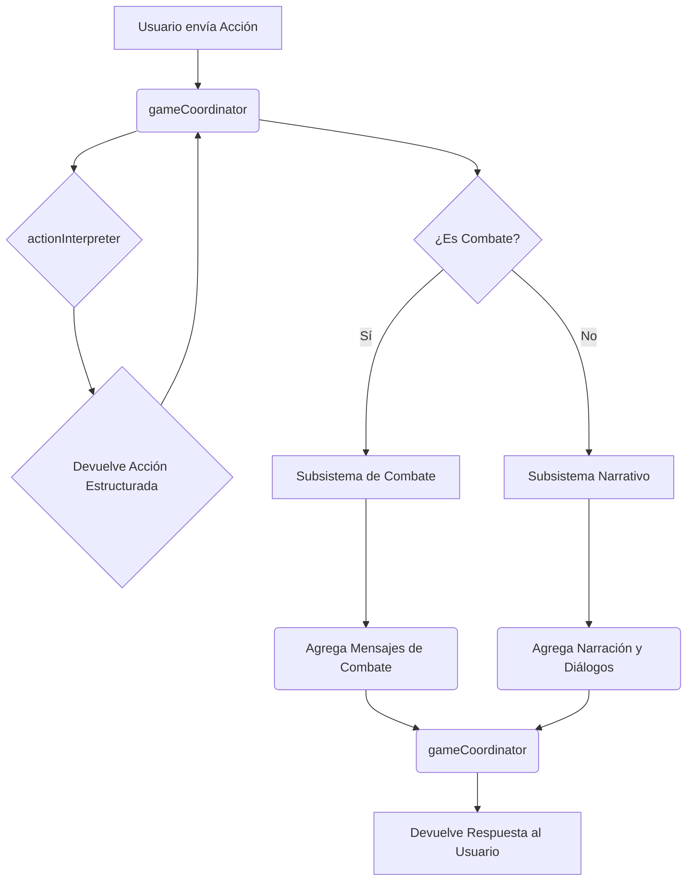

# Arquitectura del Backend (Sistema de IA)

En este proyecto, la totalidad de la lógica del lado del servidor (el **backend**) está contenida en el sistema de Inteligencia Artificial construido con Genkit. Por lo tanto, este documento describe la arquitectura de dicho sistema, que es la base de todo el funcionamiento del juego. 

El sistema está diseñado para ser modular, predecible y extensible.

---

## Principios de Diseño

La arquitectura se basa en cuatro principios fundamentales:

1.  **Especialización:** Cada flujo de IA es un "experto" con una única responsabilidad (interpretar, narrar, decidir tácticas). Esto evita la creación de una IA monolítica y difícil de depurar.

2.  **Orquestación Lógica:** Un director de orquesta no-IA (`gameCoordinator`) toma las decisiones lógicas. No genera texto, sino que dirige el flujo de datos y decide qué experto llamar en cada momento, garantizando un proceso predecible.

3.  **Flujo de Datos Explícito:** No hay estado global ni dependencias ocultas. Todos los datos que una herramienta o flujo necesita (como el contexto de la ubicación o los datos de los personajes) se le pasan explícitamente como parámetros. Esto hace que el sistema sea robusto y fácil de razonar.

4.  **Abstracción con Herramientas:** Las IAs no interactúan directamente con el mundo del juego. Usan "herramientas" (funciones de TypeScript) para obtener información (ej: `locationLookupTool`) o realizar acciones (ej: `diceRollerTool`).

---

## Diagrama de Flujo de un Turno Típico



---

## Desglose de Componentes

### 1. El Orquestador Lógico

#### `gameCoordinator`
-   **Archivo**: `src/ai/flows/game-coordinator.ts`
-   **Rol**: El cerebro lógico y director de orquesta del juego.
-   **Responsabilidades**:
    1.  Recibir el estado completo del juego desde el cliente.
    2.  Invocar al `actionInterpreter` para entender la intención del jugador.
    3.  Enrutar la lógica a los subsistemas correspondientes (Combate, Narrativa, OOC).
    4.  Gestionar cambios de estado de alto nivel (cambio de ubicación, inicio/fin de combate).
    5.  Agregar todas las respuestas generadas en el turno.
    6.  Devolver el estado final y los mensajes al cliente.

### 2. Expertos de IA Primarios

#### `actionInterpreter`
-   **Archivo**: `src/ai/flows/action-interpreter.ts`
-   **Rol**: El "oído" del DM. Traduce el lenguaje natural del jugador a un objeto de acción estructurado.
-   **Ejemplo**: `"Ataco al goblin"` -> `{ actionType: 'attack', targetId: 'goblin' }`.

#### `narrativeExpert`
-   **Archivo**: `src/ai/flows/narrative-expert.ts`
-   **Rol**: El "cuentacuentos". Genera la descripción de escenas, el resultado de acciones no combativas y el diálogo de PNJs.

### 3. El Subsistema de Combate

Este conjunto de herramientas y flujos se activa cuando `inCombat` es `true`.

#### `combatInitiationExpertTool`
-   **Archivo**: `src/ai/tools/combat-initiation-expert.ts`
-   **Rol**: El "guardián". Determina si una acción de ataque debe iniciar un combate y quiénes son los combatientes.

#### `combatManagerTool`
-   **Archivo**: `src/ai/tools/combat-manager.ts`
-   **Rol**: El "árbitro". Gestiona el orden de iniciativa y orquesta los turnos de los PNJ (enemigos y compañeros) hasta que le toca de nuevo al jugador.

#### `enemyTacticianTool`
-   **Archivo**: `src/ai/tools/enemy-tactician.ts`
-   **Rol**: El "cerebro táctico" de los enemigos. Decide la acción más lógica para un PNJ hostil durante su turno.

### 4. Herramientas de Apoyo

#### `companionExpertTool`
-   **Archivo**: `src/ai/tools/companion-expert.ts`
-   **Rol**: La "personalidad" de los compañeros de IA. Genera sus diálogos y acciones en función del contexto.

#### `locationLookupTool`
-   **Archivo**: `src/ai/tools/location-lookup.ts`
-   **Rol**: El "GPS". Permite al `actionInterpreter` encontrar ubicaciones en el mundo del juego basándose en el texto del jugador.

#### Otras Herramientas
-   **`diceRollerTool`**: Lanza dados virtuales (`1d20+5`).
-   **`characterLookupTool`**: Consulta la ficha de un personaje del grupo.
-   **`adventureLookupTool`**: Consulta datos generales de la aventura (PNJs, objetos).

---

## Apéndice: Flujo de Datos de un Turno de Ataque

Este ejemplo detalla cómo fluyen los datos a través del sistema tras el refactor, de forma explícita y predecible.

**1. Origen (Cliente - `game-view.tsx`)**
-   El jugador escribe: `"¡A la carga! Ataco a la mantícora con mi espada."`
-   `handleSendMessage` recopila el estado:
    ```json
    {
      "playerAction": "¡A la carga! Ataco a la mantícora con mi espada.",
      "party": [ { "id": "elara", ... }, { "id": "merryl", ... } ],
      "locationId": "colina-del-resentimiento",
      "inCombat": false
    }
    ```

**2. `gameCoordinator` recibe los datos**
-   El `gameCoordinator` recibe el JSON anterior como su `input`.
-   **Acción**: Invoca al `actionInterpreter`, pasándole `playerAction`, `locationContext` y `party`.

**3. `actionInterpreter` interpreta la intención**
-   Recibe los datos, incluyendo la `party`, que ahora usa para descartar que sea una interacción con un compañero.
-   El prompt prioriza "Ataco a la mantícora" como una acción de combate.
-   **Salida**: Devuelve `{ actionType: 'attack', targetId: 'Mantícora' }`.

**4. `gameCoordinator` enruta al subsistema de combate**
-   El `gameCoordinator` ve `actionType: 'attack'`. Entra en el bloque de lógica de combate.
-   **Acción**: Invoca al `combatInitiationExpertTool`.
-   **Entrada para la herramienta**:
    ```json
    {
        "playerAction": "...",
        "targetId": "Mantícora",
        "locationContext": { ... },
        "party": [ { "id": "elara", ... }, { "id": "merryl", ... } ] // <-- Flujo de datos explícito
    }
    ```

**5. El `combatInitiationExpert` determina los combatientes**
-   La herramienta usa el `locationContext` para encontrar a la "Mantícora" y la `party` para encontrar a los héroes.
-   **Salida**: Devuelve `{ combatantIds: ["elara", "merryl", "mantícora-1"] }`.

**6. `gameCoordinator` delega al `combatManager`**
-   El `gameCoordinator` recibe la lista de combatientes.
-   **Acción**: Llama al `combatManagerTool` por primera vez, pasándole la lista de `combatantIds` para que calcule la iniciativa y ejecute la primera acción del jugador.

**7. El ciclo se completa**
-   El `combatManagerTool` devuelve todos los mensajes del primer turno (la tirada de ataque, el daño, etc.).
-   El `gameCoordinator` agrega estos mensajes y devuelve el nuevo estado (`inCombat: true`, el orden de iniciativa, etc.) al cliente.
