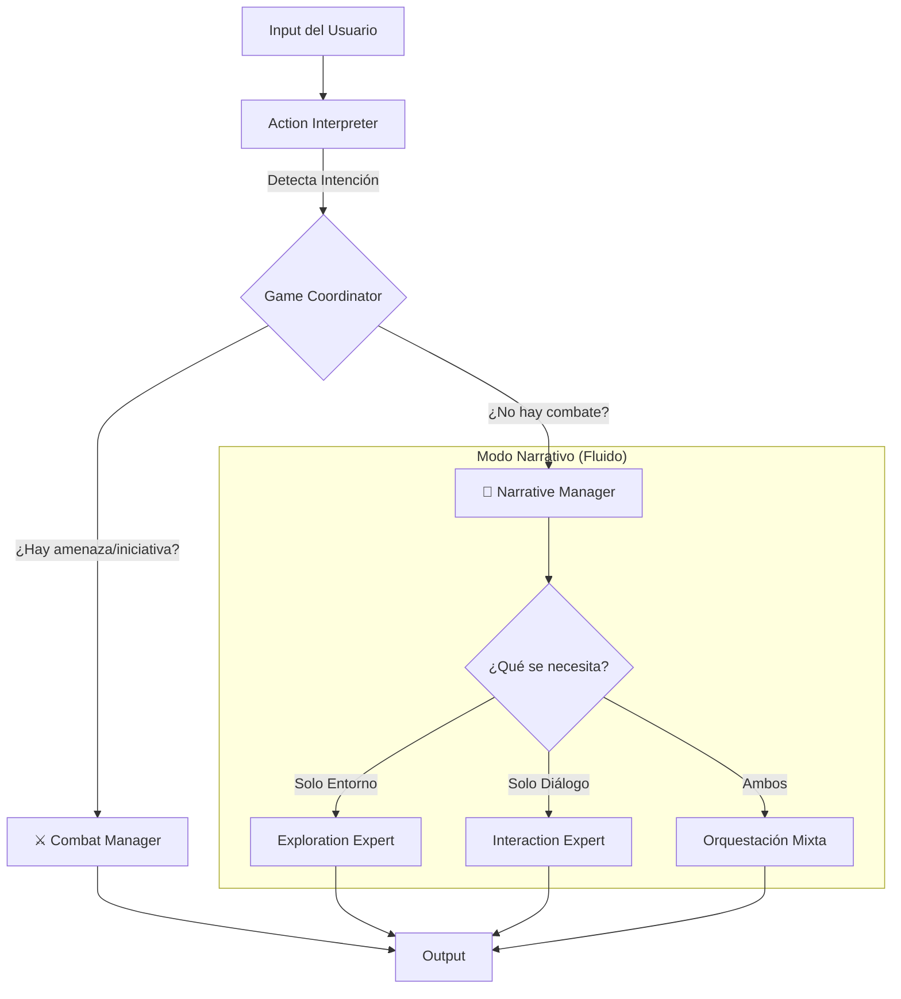

# Análisis Integral del Proyecto: D&D Adventures AI
> **Fecha de Creación:** 19 de Noviembre de 2025, 11:57

## 1. Veredicto Ejecutivo 🏁

**El proyecto va por MUY BUEN camino.**

La arquitectura base es **sólida, moderna y sorprendentemente madura** para una versión v0.5.0. La decisión de desacoplar completamente el frontend (estado) del backend (lógica stateless) es un acierto arquitectónico mayor que evitará muchísimos dolores de cabeza de sincronización en el futuro.

No es necesario reestructurar la aplicación desde cero. Los cimientos son buenos. El reto ahora no es "arreglar" la base, sino **construir las capas de persistencia y profundidad** que faltan para pasar de una "demo técnica impresionante" a un "juego completo".

---

## 2. Análisis de Arquitectura y Cimientos 🏗️

### ✅ Lo que está Bien (Puntos Fuertes)

1.  **Arquitectura Stateless (Sin Estado):**
    *   El backend no guarda nada. Recibe `Estado A`, procesa, y devuelve `Estado B`.
    *   **Por qué es genial:** Elimina bugs de "desincronización", hace que el testing sea trivial (input -> output determinista) y permite escalar horizontalmente sin problemas.
    *   **Veredicto:** Mantener a toda costa.

2.  **Modularidad de la IA (Patrón de Expertos):**
    *   En lugar de un "Mega-Prompt" que intente hacerlo todo, tienes agentes especializados (`narrativeExpert`, `combatManager`, `actionInterpreter`).
    *   **Por qué es genial:** Permite ajustar la "creatividad" de la narración sin romper la "rigidez" de las reglas de combate. Si el combate falla, solo arreglas `combatManager`.
    *   **Veredicto:** Excelente diseño.

3.  **Validación Estricta (Zod Schemas):**
    *   El uso de `schemas.ts` como contrato único entre cliente y servidor es profesional.
    *   **Por qué es genial:** Previene que la IA "alucine" estructuras de datos inválidas. Si la IA devuelve basura, el sistema lo atrapa antes de que rompa la UI.

4.  **Sistema de Aventuras JSON:**
    *   Separar datos (aventura) de lógica (motor) es fundamental.
    *   **Por qué es genial:** Permite crear contenido nuevo sin tocar código. Abre la puerta a contenido generado por la comunidad o herramientas externas.

### ⚠️ Puntos de Atención y Riesgos

1.  **El "God Object" `combat-manager.ts`:**
    *   Con casi 2000 líneas, este archivo está peligrosamente grande. Hace demasiadas cosas: gestiona turnos, tira dados, aplica daño, narra, valida...
    *   **Riesgo:** Será muy difícil de mantener o ampliar (ej: añadir hechizos complejos) sin romper algo.
    *   **Acción:** Necesita refactorización urgente (ya mencionada en el Roadmap).

2.  **Dependencia Crítica de API Externa:**
    *   El juego depende de la API pública de D&D 5e.
    *   **Riesgo:** Si la API cae o cambia, el juego muere. Además, añade latencia en cada consulta.
    *   **Acción:** Priorizar el "Compendio Local" (SQLite) es la decisión correcta.

3.  **Falta de Persistencia Real:**
    *   Actualmente es una experiencia "One-Shot". No hay base de datos.
    *   **Riesgo:** Limita el juego a sesiones cortas. No hay sensación de progreso a largo plazo.

---

## 3. Evaluación del Motor de Juego (Game Engine) ⚙️

### `gameCoordinator` (El Cerebro)
*   **Estado:** Muy bien estructurado.
*   **Análisis:** Actúa correctamente como un "router" lógico. La gestión de prioridades (Muerte -> Combate -> Narración) es correcta.
*   **Mejora:** Podría beneficiarse de un sistema de "Eventos" más formal para no tener tantos `if/else` anidados.

### `narrativeExpert` (El Bardo)
*   **Estado:** Funcional y seguro.
*   **Análisis:** La separación entre "decidir" y "narrar" es clave. Al forzarle a usar el contexto local, se evitan alucinaciones.
*   **Mejora:** Actualmente es muy reactivo (Turno A -> Respuesta B). Le falta memoria a largo plazo para referenciar eventos pasados ("Como vimos en la cueva anterior...").

### `combatManager` (El General)
*   **Estado:** Funcional pero sobrecargado.
*   **Análisis:** Es el módulo más frágil. Mezcla lógica de reglas (D&D) con lógica de flujo (turnos) y lógica de presentación (mensajes).
*   **Mejora:** Separar en: `RulesEngine` (calcula daño/aciertos), `TurnManager` (gestiona índices) y `CombatNarrator` (genera texto).

### `actionInterpreter` (El Traductor)
*   **Estado:** Robusto.
*   **Análisis:** El sistema de prioridades y el fallback de "emergencia" (regex simple) son excelentes decisiones de ingeniería para evitar bloqueos.

---

## 4. Propuesta de Evolución Arquitectónica: Sistema Híbrido (Duro vs Blando) 🏛️

Para capturar la fluidez real de una partida de D&D sin sacrificar la robustez técnica, se propone una arquitectura de **Dos Estados Mayores** en lugar de tres modos rígidos.

### El Concepto: Rigidez vs Fluidez
En una mesa real, los jugadores hablan mientras caminan (Interacción + Exploración). Forzar una separación estricta entre estos dos rompería la inmersión. Sin embargo, el Combate sí requiere una rigidez absoluta (turnos, reglas).

### Nueva Estructura de Flujo

### 1. Modo Duro (Hard Mode): `CombatManager` ⚔️
*   **Estado:** Activo cuando `IN_COMBAT === true`.
*   **Comportamiento:** Exclusivo y Bloqueante. El tiempo narrativo se detiene y entra el "Tiempo Táctico".
*   **Restricciones:** Se bloquean viajes rápidos y conversaciones largas. Todo se rige por turnos e iniciativa.

### 2. Modo Blando (Soft Mode): `NarrativeManager` (Evolución de `NarrativeExpert`) 🌍💬
*   **Estado:** Activo cuando `IN_COMBAT === false`.
*   **Cambio:** El actual `NarrativeExpert` se refactoriza para dejar de ser un generador de texto monolítico y convertirse en un **Orquestador**.
*   **Comportamiento:** Fluido y Orquestado. Utiliza herramientas especializadas según la intención del jugador.
*   **Sub-Componentes (Nuevos/Extraídos):**
    *   **Exploration Expert:** Gestiona entorno, percepción y movimiento.
    *   **Interaction Expert:** Gestiona diálogos, psicología de NPC y tiradas sociales.
*   **Orquestación Mixta:** Si el jugador dice *"Le pregunto al guía por qué tiembla mientras cruzamos el bosque"*, el `NarrativeManager` invoca a ambos expertos y sintetiza una respuesta coherente.

### Ventajas del Cambio
1.  **Naturalidad:** Permite acciones complejas y realistas (hablar y actuar a la vez).
2.  **Limpieza de Código:** Mantiene la separación técnica de módulos (Exploración/Interacción/Combate) pero unifica la experiencia de usuario (Combate/No-Combate).
3.  **Robustez:** El combate sigue protegido por reglas estrictas, mientras la narrativa gana flexibilidad.

---

## 5. Hoja de Ruta Recomendada 🗺️

Si yo fuera el Lead Developer de este proyecto, este sería mi plan de ataque:

### Fase 1: Refactorización y Estabilidad (Inmediato)
1.  **Implementar Arquitectura Híbrida:** [COMPLETADO] Crear el `NarrativeManager` que orqueste `Exploration` e `Interaction` bajo un modo fluido.
    *   *Ver plan completado:* [plan-implementacion-narrative-manager.md](planes-desarrollo/completados/plan-implementacion-narrative-manager.md)
2.  **Romper `combat-manager.ts`:** Extraer la lógica de reglas de D&D a funciones puras.
3.  **Compendio Local:** Implementar SQLite/JSON local para eliminar dependencia de API externa.

### Fase 2: Profundidad y Persistencia (Corto Plazo)
1.  **Persistencia (Base de Datos):** Implementar una DB real (SQLite o Firestore).
2.  **Sistema de Progresión:** Implementar XP y subida de nivel.

### Fase 3: Vida y Reactividad (Medio Plazo)
1.  **Mundo Reactivo:** Implementar evaluación de hostilidad.
2.  **Memoria a Largo Plazo (RAG):** Base de datos vectorial para recordar eventos pasados.

---

## 6. Conclusión Final

**No reestructures desde cero.** La base es excelente.
La adopción de la **Arquitectura de 3 Modos** es el siguiente paso lógico para madurar el proyecto, permitiendo una profundidad mecánica que la estructura actual no puede soportar fácilmente.

**Sigue construyendo sobre estos cimientos.** Tienes un motor de rol muy potente entre manos.
