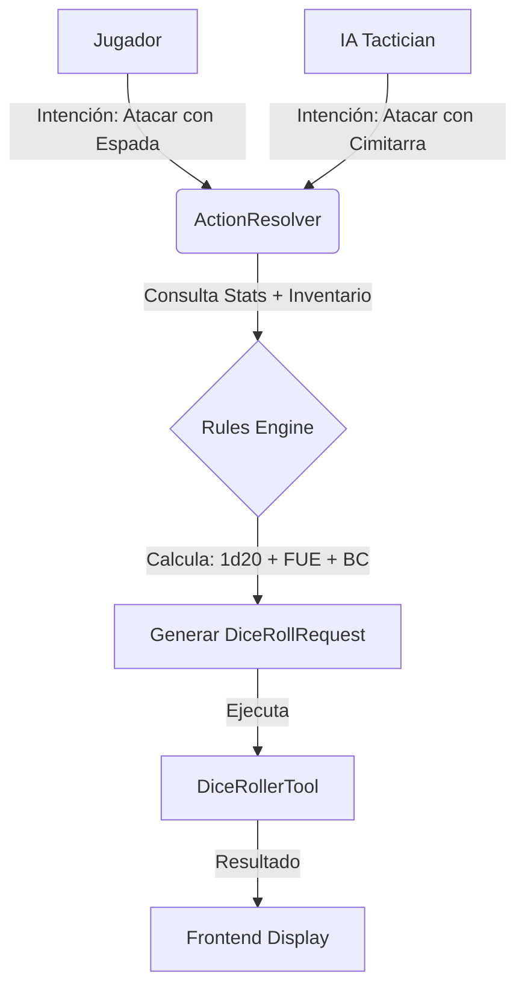

# Plan: Sistema de Tiradas Robusto y Unificado

**Fecha:** 2025-11-22
**Estado:** Borrador
**Objetivo:** Eliminar la discrepancia entre la lógica de tiradas de la IA y del Jugador, centralizando la "fuente de la verdad" en las estadísticas del sistema.

## 1. Análisis de la Situación Actual

### El Problema de la "Doble Verdad"
Actualmente, el sistema opera con dos lógicas distintas:

1.  **Jugador (Determinista):**
    *   `TurnProcessor` lee la ficha del personaje.
    *   Calcula: `1d20` + `FUE (+3)` + `BC (+2)` = `1d20+5`.
    *   Resultado: Matemáticamente perfecto y explicable.

2.  **IA - Enemigos/Compañeros (Probabilístico):**
    *   El Prompt (Tactician) pide a la IA que genere el JSON de la tirada: `{"rollNotation": "1d20+4"}`.
    *   La IA "adivina" o busca este +4.
    *   **Riesgo:** Si la IA se equivoca o alucina un modificador diferente al de la ficha, el sistema visual intenta "desglosar" ese número usando las estadísticas reales, provocando inconsistencias (ej. desglose que suma 3 cuando el total suma 5).

### Vulnerabilidades Identificadas
*   **Fragilidad Visual:** El frontend intenta explicar tiradas que no ha calculado él mismo.
*   **Dependencia del LLM:** Confiamos en que el LLM sepa las reglas de D&D para calcular bonificadores, lo cual es propenso a errores.
*   **Mantenimiento:** Si cambiamos una regla (ej. bonificador de flanqueo), tenemos que cambiar el prompt de la IA, no solo el código.

## 2. Arquitectura Propuesta: "Intención vs. Resolución"

Para lograr un sistema robusto, debemos separar la **Intención** (qué quiere hacer la IA) de la **Resolución** (qué dados se tiran).

### Nuevo Flujo Unificado

### Cambios Clave

1.  **Simplificar Prompts de IA:**
    *   La IA ya no debe devolver `rollNotation` ("1d20+4").
    *   La IA solo debe devolver la **Intención**: `{"action": "attack", "weapon": "cimitarra", "targetId": "..."}`.

2.  **Centralizar la Lógica de Cálculo (`ActionResolver`):**
    *   Crear un servicio que reciba `(Combatant, Action)` y devuelva `DiceRollRequest[]`.
    *   Este servicio buscará en la ficha del combatiente (sea PJ o NPC) sus stats y armas para calcular los bonificadores correctos.

3.  **Estandarizar Datos de Enemigos:**
    *   Los enemigos deben tener una estructura de datos mínima fiable (`stats`, `attacks` predefinidos) para que el `ActionResolver` pueda calcular sus tiradas sin depender de la IA.

## 3. Plan de Implementación

### Fase 1: Estandarización de Datos (La Base)
- [x] Revisar `new-game-data.ts` y asegurar que todos los enemigos tengan `abilityScores`, `proficiencyBonus` y `attacks` definidos correctamente. (COMPLETADO)
- [x] Definir una interfaz común `CombatantStats` que compartan Characters y Enemies. (COMPLETADO en `types.ts`)

### Fase 2: Motor de Resolución (`ActionResolver`)
- [x] Extraer la lógica de cálculo de ataque del `TurnProcessor` (actualmente solo para jugadores) a una clase reutilizable `CombatActionResolver`. (COMPLETADO)
- [x] Implementar métodos: `resolveAttack(attacker, weaponName)`, `resolveSpell(attacker, spellName)`. (COMPLETADO - resolveAttack implementado, spell pendiente para futuro)

### Fase 3: Refactorización de IA
- [x] Modificar `EnemyTactician` y `CompanionTactician` para que devuelvan intenciones de alto nivel en lugar de arrays de dados. (COMPLETADO)
- [x] Actualizar `TurnProcessor` para usar `CombatActionResolver` cuando procese turnos de IA. (COMPLETADO)

### Fase 4: Limpieza
- [x] Eliminar la lógica de "parcheo" en `roll-notation-utils.ts` ya que las tiradas vendrán limpias y calculadas por el sistema. (VERIFICADO - El parche es necesario para evitar duplicación visual, se mantiene)

## 4. Beneficios
*   **Consistencia Total:** Jugadores y Enemigos siguen las mismas reglas matemáticas.
*   **Visualización Perfecta:** El desglose visual siempre coincidirá con el cálculo matemático.
*   **Menor coste de Tokens:** Prompts más simples y respuestas JSON más pequeñas.
*   **Robustez:** Si la IA alucina, el sistema corrige usando las reglas reales.
